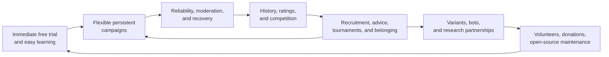

# Frontend Selection and webDiplomacy Success Deep Dive

**Status:** Owner-approved baseline; bounded rules-laboratory validation remains

**Date:** 2026-08-16

**Decision owner:** Project owner

**Research work item:** `RSH-WEB-002`

## Executive conclusion

Use **Vue 3 with Vite and strict TypeScript** for Sandtable's Maproom client. Use Vue's Composition
API and Vue Router, keep the map renderer in framework-independent TypeScript, and serve the
production assets from the same-origin ASP.NET Core Maproom boundary. Do not use Nuxt, Next.js,
Blazor, or a JavaScript server-rendering layer.

React with Vite is a sound fallback, but it is not the leading recommendation. React would give
Sandtable the broadest ecosystem and hiring familiarity, while requiring more assembly and more
project conventions around hooks, server state, routing, and rendering discipline. Vue gives this
small project a more coherent official SPA toolchain and a simpler fine-grained reactive model
without taking server ownership away from ASP.NET Core.

Do not choose the final map renderer as part of the framework decision. Begin the rules-laboratory
prototype with semantic HTML plus SVG. Keep the projection, hit testing, selection model, camera,
and drawing boundary independent of Vue so that Canvas or WebGL can replace only the renderer if a
measured board workload later requires it.

The deeper webDiplomacy finding is equally direct: its durable success is a **compounding product
and community system**, not an architecture story. It made a difficult social board game easy to
try, dependable to play asynchronously, meaningful to master, recoverable when people disappear,
and socially rewarding between turns. Its history, reputation, competition, community, variants,
volunteer operations, and later AI/research relationships reinforce one another.

Sandtable should copy none of the implementation, but it should preserve that causal pattern:

> remove setup and adjudication friction -> make long campaigns dependable -> give play durable
> history and identity -> help a small community organize itself -> keep adding reasons to return.

## Scope and decision boundary

This packet answers two questions:

1. Which non-Next.js TypeScript frontend should Sandtable use for Maproom?
2. What can the canonical repository and live webDiplomacy product tell us about why an obscure
   board-game implementation has remained active for roughly two decades?

In scope:

- Vue, React, Svelte, and Angular as credible frontend foundations;
- build, routing, state, testing, accessibility, map integration, and ASP.NET Core fit;
- the canonical webDiplomacy repository at a fixed revision;
- the signed-out live product, anonymous AI onboarding, board, and community forum;
- evidenced success factors, Sandtable inferences, and maturity gates; and
- retained product and architecture consequences.

Out of scope:

- implementing Maproom or adding JavaScript dependencies;
- selecting a component library, CSS framework, map library, or cloud vendor;
- copying webDiplomacy code, schema, visual assets, or deployment architecture;
- creating a webDiplomacy account, joining a human game, messaging, or submitting an order; and
- claiming private retention, revenue, unique-user, or concurrency metrics that are unavailable.

## Evidence method

The framework comparison used current official documentation observed on 2026-08-16. The product
analysis inspected:

- `kestasjk/webDiplomacy` at commit
  [`f5dffbe944c2d2c7b143946362cacbf486d03860`](https://github.com/kestasjk/webDiplomacy/tree/f5dffbe944c2d2c7b143946362cacbf486d03860);
- the signed-out [live play site](https://play.webdiplomacy.net/);
- the signed-out [community forum](https://webdiplomacy.net/contrib/phpBB3/); and
- first-party help, rules, scoring, variant, moderation, and AI-research material.

One product behavior deserves explicit disclosure. Navigating to the live signed-out "Start a New
Game" URL automatically created temporary guest bot game `2190564` and redirected to its board.
No account, personal data, message, or order was submitted. This was useful evidence of extremely
low onboarding friction, but Sandtable must not copy mutation through an ordinary navigation.

Evidence labels mean:

- **Documented fact:** stated by an official framework or first-party project source.
- **Repository observation:** directly present at the fixed webDiplomacy commit.
- **Live observation:** directly visible on the public product at the stated time.
- **Inference:** a conclusion for Sandtable drawn from facts and observations.
- **Unknown:** material evidence unavailable from public inspection.

## Frontend recommendation

### Recommended baseline

| Concern | Recommended choice |
| --- | --- |
| UI framework | Vue 3 Composition API with `<script setup>` |
| Language | TypeScript with strict checking |
| Build/dev server | Vite |
| Routing | Vue Router, history mode |
| Authoritative/server state | Typed same-origin HTTP modules; add TanStack Vue Query only when cache/refetch behavior earns it |
| Client-only shared state | Vue composables first; Pinia only when cross-route state becomes substantial |
| Map | Semantic HTML controls plus SVG first; renderer behind a framework-independent TypeScript interface |
| Component tests | Vitest in a real browser where interaction behavior matters |
| End-to-end tests | Playwright against the ASP.NET Core boundary |
| Production host | Static client assets and `/api` from the same ASP.NET Core origin |
| Explicit exclusions | Next.js, Nuxt, Blazor, React Server Components, a Node production server, duplicated client rules |

The official Vue scaffold is Vite-based and can opt into TypeScript, Vue Router, Pinia, Vitest,
Playwright, ESLint, and formatting without a third-party starter. Vue's current official guidance
describes Vue 3 as the supported major and Composition API as the TypeScript-oriented organization
model. [Vue quick start](https://vuejs.org/guide/quick-start.html),
[Vue TypeScript overview](https://vuejs.org/guide/typescript/overview),
[Composition API FAQ](https://vuejs.org/guide/extras/composition-api-faq)

**Inference:** this is the best balance for Sandtable because the client is a focused authenticated
application, not a content site. ASP.NET Core already owns authentication, authorization, routing
to authoritative services, telemetry, and deployment. Vue supplies the interactive browser layer
without introducing a competing full-stack server model.

### Option comparison

| Option | Strengths for Sandtable | Material costs | Decision |
| --- | --- | --- | --- |
| **Vue 3 + Vite** | Coherent official SPA scaffold; readable SFCs; strong TypeScript support; fine-grained dependency tracking; official Router and Pinia; low server coupling | Smaller labor/ecosystem pool than React; team must standardize Composition API and avoid overusing global reactivity | **Recommend** |
| **React + Vite** | Largest ecosystem; excellent map/visualization interoperability; React is acceptable to the owner; strong long-term escape hatch | Bare SPA requires selecting and governing router, fetching, cache, state, and hook conventions; easier to create render/effect complexity | **Viable fallback** |
| **Svelte/SvelteKit** | Concise components; compiler minimizes browser work; pleasant local reactivity | Official routing centers SvelteKit; its SPA documentation warns of client-only startup costs; adds a second full-stack application model beside ASP.NET Core | **Do not select for Maproom** |
| **Angular** | Mature, integrated routing/forms/DI/tooling; strong large-team conventions | Broad application framework and conventions duplicate structure Sandtable already owns; highest initial ceremony for the small rules-lab client | **Do not select initially** |

React's own documentation supports Vite for a client SPA but cautions that building without a
framework means assembling routing, data fetching, and performance conventions. React Router's
Data Mode is a reasonable controlled alternative if React is chosen. [React from scratch](https://react.dev/learn/build-a-react-app-from-scratch),
[React Router modes](https://reactrouter.com/start/modes)

Svelte itself remains credible, but its official package catalog identifies SvelteKit as the
official router, and SvelteKit warns that full SPA mode imposes extra startup round trips and
recommends prerendering or server rendering where possible. Those server features would compete
with rather than complement Sandtable's ASP.NET Core boundary. [Svelte packages](https://svelte.dev/packages),
[SvelteKit SPA guidance](https://svelte.dev/docs/kit/single-page-apps)

Angular provides a complete suite—signals, routing, forms, dependency injection, CLI, SSR, and
devtools. That breadth is valuable for a large frontend organization but is not currently a
Sandtable requirement. [Angular overview](https://angular.dev/overview)

Vite is common infrastructure across the leading candidates, produces ordinary production assets,
and supports modern baseline browsers with an explicit legacy option. Vitest can execute component
tests in actual Chromium, Firefox, or WebKit through Playwright. [Vite guide](https://vite.dev/guide/),
[Vitest browser mode](https://vitest.dev/guide/browser/)

### Why Vue is not a performance bet

The recommendation does not depend on a synthetic framework benchmark. For Sandtable, the likely
performance risks are:

- redrawing too much of a large counter/map surface;
- leaking authoritative state into a giant client store;
- shipping oversized art or renderer dependencies;
- triggering redundant projection fetches after reconnect; and
- coupling every pointer move to component-tree updates.

The renderer boundary matters more than the component syntax. Vue should own application chrome,
panels, dialogs, reports, forms, keyboard controls, and the lifecycle of a map host. A pure
TypeScript renderer should consume an immutable side-safe view model and emit semantic player
intent. It must not own campaign rules or invent legal actions.

### Prototype validation gate before dependency commitment becomes expensive

The later nine-hex rules-laboratory prototype should validate the recommendation using the real
observation/legal-action contract. It should demonstrate:

1. map selection and camera movement without duplicated legality rules;
2. pointer, keyboard, and non-drag action entry;
3. a private mutable draft distinct from final version-bound submission;
4. stale-state rejection followed by full authorized refetch;
5. reconnect and missed-SignalR-notification recovery;
6. side-safe negative tests at the browser/API boundary;
7. component tests in a browser and end-to-end tests against ASP.NET Core; and
8. measured cold-load, interaction latency, memory, and bundle composition on target hardware.

The accepted baseline changes only if that bounded prototype shows a material Vue-specific obstacle
or if the actual maintainers have substantially stronger React expertise and accept the additional
conventions. A framework rewrite remains cheap before Maproom contains campaign workflows.

## What appears to have made webDiplomacy successful

### The success flywheel

This diagram is an **inference**. The individual mechanisms are publicly evidenced; their relative
effect on retention cannot be proven without internal analytics or user research.

### 1. It is unusually easy to try a difficult game

- **Documented fact:** the first-party FAQ describes webDiplomacy as created in 2004, free to play,
  historically ad-free/nonprofit, and intended to remove large time and money commitments.
  [FAQ source at the inspected revision](https://github.com/kestasjk/webDiplomacy/blob/f5dffbe944c2d2c7b143946362cacbf486d03860/locales/English/faq.php)
- **Live observation:** the signed-out home page leads with one action to start against AI. That
  action generated a guest identity and a playable game without registration.
- **Live observation:** the bot board immediately presents the map, current country, phase,
  remaining time, auto-save, Ready, press, information, controls, game switching, and help.
- **Inference:** webDiplomacy gives a curious visitor a story-producing experience before asking
  them to understand its community economy. This is likely one of its strongest acquisition loops.

Sandtable consequence: the first-run local scenario should open directly into a guided Command
decision. Accounts, hosting choices, model configuration, and campaign administration must not
stand between a new player and the first meaningful action.

### 2. Diplomacy maps naturally to persistent asynchronous play

- **Documented fact:** orders are simultaneous and secret until adjudication, which removes the
  need for continuous turn-by-turn presence. The game-creation flow supports phase lengths from
  minutes to days, live or non-live pacing, several press modes, anonymity, and multiple missing-
  player policies. [Game creation source](https://github.com/kestasjk/webDiplomacy/blob/f5dffbe944c2d2c7b143946362cacbf486d03860/locales/English/gamecreate.php)
- **Documented fact:** players can save orders as editable drafts or mark them Ready; a phase can
  resolve early once all players are ready.
- **Inference:** the product respects both human rhythms: thoughtful correspondence over days and
  an evening session with short deadlines. One durable campaign model serves both.

Sandtable consequence: use mechanic-specific decision windows rather than copying Diplomacy's one
deadline per simultaneous phase. Keep the same save-draft/final-submit distinction and allow an
authorized campaign to accelerate only when every mandatory decision is truly complete.

### 3. It attacks the reliability problem directly

- **Documented fact:** a visible Reliability Rating reflects missed phases. Creators can require a
  minimum rating; repeated misses can restrict joining/creation, and games can define removal or
  replacement behavior. [Intro and reliability explanation](https://github.com/kestasjk/webDiplomacy/blob/f5dffbe944c2d2c7b143946362cacbf486d03860/locales/English/intro.php)
- **Repository observation:** moderation and administration cover pause, takeover, restoration,
  crash handling, and player investigation.
- **Inference:** this is market infrastructure for an asynchronous niche. It helps dependable
  players find one another and prevents one absent participant from destroying weeks of shared
  investment.

Sandtable consequence: private alpha should favor humane pause, replacement, reminders, and clear
status before punishment. If public matchmaking ever exists, reliability should describe
observable campaign behavior and include appeal/excusal paths; it must not become an opaque social
score.

### 4. It gives mastery durable identity and stakes

- **Documented fact:** profiles retain game history, outcomes, points, reliability, and Ghost
  Ratings. Ratings are segmented by modes such as full press, no press, live, and one-versus-one.
- **Documented fact:** the point economy creates stakes but has a floor, so losing does not
  permanently lock a player out. Different scoring systems create different strategic incentives.
  [Points and scoring source](https://github.com/kestasjk/webDiplomacy/blob/f5dffbe944c2d2c7b143946362cacbf486d03860/locales/English/points.php)
- **Inference:** long games feel cumulative because results become reputation, stories, and
  qualification for stronger opposition—not merely a transient win screen.

Sandtable consequence: Chronicle, War Diary, scenario completion, and exact replay identity are
the right early foundation. Public ladders and virtual stakes are not private-alpha requirements;
later recognition should separate scenario, ruleset, side, assistance mode, and campaign format.

### 5. The community is part of the product

- **Live observation:** on 2026-08-16 the community forum showed 499,543 posts, 6,146 topics, and
  35,850 forum members. New-game recruitment, feedback, development, strategy, advice, forum
  games, and general discussion all had 2026 activity; several had same-day posts.
- **Live observation:** the forum explicitly supports mentor-style advice, tournament calendars,
  face-to-face meetups, private-game recruitment, development planning, and moderator contact.
- **Inference:** webDiplomacy is successful as a niche institution. The game supplies repeated
  shared experiences; the forum turns those experiences into relationships, knowledge, events,
  volunteer labor, and reasons to remain when a player is between campaigns.

Sandtable consequence: do not build a forum in the application. First make campaigns worth talking
about and provide durable, consent-safe artifacts—scenario IDs, result summaries, replays, and War
Diary excerpts—that players can share in whichever community already exists. Add native community
features only when a real community demonstrates the need and moderation capacity.

### 6. It offers depth after the core game is learned

- **Repository observation:** the inspected tree contains 14 playable variant manifests ranging
  from two-player adaptations to a 34-player Chaos map, plus different eras and geographies.
- **Documented fact:** game creation also varies press, anonymity, deadlines, scoring, draw
  visibility, reliability requirements, and missing-player behavior.
- **Inference:** one learned rules language produces many fresh social situations. The product can
  retain experts without replacing the core game every season.

Sandtable consequence: Sandtable's equivalent is not arbitrary rule variants during pre-alpha. It
is a strong content-pack/scenario boundary that can later support different starts, operational
problems, sides, optional rulings, assistance modes, and campaign lengths while preserving exact
identity and replay.

### 7. Trust is operated, not assumed

- **Documented fact:** site rules cover outside relationships, private games, collusion, press-mode
  boundaries, harassment, multi-account behavior, and use of moderation tools. Players can contact
  moderators from a game. [Site-rules source](https://github.com/kestasjk/webDiplomacy/blob/f5dffbe944c2d2c7b143946362cacbf486d03860/locales/English/rules.php)
- **Repository observation:** the codebase has dedicated moderator, forum, admin, recovery, and
  tournament surfaces.
- **Inference:** a hidden-information social game cannot sustain public competition through code
  alone. Human adjudication, recovery policy, appeals, and community norms are product features.

Sandtable consequence: invite-only play avoids much of this burden initially. Before public play,
write the abuse, cheating, recovery, privacy, evidence-retention, and appeal model before opening
registration—not after the first incident.

### 8. Long stewardship compounds into a moat

- **Repository observation:** GitHub currently displays 3,522 commits; the inspected tree contains
  49 versioned install/migration directories and both legacy and newer TypeScript board surfaces.
  The latest inspected commit is from 2026. [Canonical repository](https://github.com/kestasjk/webDiplomacy)
- **Documented fact:** first-party material describes the project as maintained over time by
  developers, moderators, players, donations, translations, variants, and forks.
- **Inference:** continuity matters more here than polish at any one moment. Each maintained season
  preserves the player pool, history, search footprint, community knowledge, and confidence that a
  months-long game will still exist tomorrow.

Sandtable consequence: deterministic migrations, contract compatibility, exportable history,
operator recovery, and modest operating costs are retention features. Avoid a platform design
that requires constant venture-scale growth to remain available.

### 9. Its accumulated corpus created a second relevance loop

- **Documented fact:** webDiplomacy's first-party AI summary says its game and press corpus enabled
  academic and industry research, bot APIs, supervised human/bot tournaments, interviews with top
  players, redacted datasets, and modernization funding. [webDiplomacy and AI Research](https://webdiplomacy.net/doc/webDiplomacy%20and%20AI%20Research.pdf)
- **Repository observation:** the current repository contains bot-game creation, bot/API support,
  and a deliberately low-friction Play Now path.
- **Inference:** research partnerships renewed the product, attracted contributors and attention,
  and created AI onboarding that can feed human community growth. The underlying asset was not a
  fashionable model; it was a large, consistently adjudicated history accumulated over years.

Sandtable consequence: retain source-cited decisions, exact rules/content identity, observations,
legal candidates, accepted commands, and outcomes from the beginning. Any future War College
corpus must be consented and privacy-safe, but high-quality deterministic history could eventually
support testing, scripted policy improvement, scholarship, and model evaluation.

## What Sandtable should adopt, defer, and avoid

### Adopt in the product foundations

- immediate local play before account or provider configuration;
- map-first information hierarchy with phase, required decision, deadline/state, draft status,
  final-submit status, history, and help always understandable;
- mutable private drafts separated from authoritative commands;
- persistent campaigns with explicit pause, resume, replacement, and recovery;
- configurable cadence without making every rules substep a notification;
- reliable conformance tests and visible rules/content identity;
- durable player-visible history and replay; and
- community-exportable artifacts without leaking fog-of-war state.

### Defer until real demand exists

- public lobby and matchmaking;
- ratings, points, ladders, tournaments, and achievements;
- integrated forum or public chat;
- spectator modes and public omniscient replays;
- public reliability scoring and automated penalties;
- user-authored variants or an open content marketplace; and
- research datasets or external bot APIs.

### Avoid copying

- the PHP/MariaDB/Redis/Node deployment and mutable-state schema;
- side effects through GET/navigation;
- whole-game payloads to the browser;
- admin rewinds that silently replace authoritative history;
- one global deadline model for CNA's many sequential decisions;
- current webDiplomacy visual design, code, or assets; and
- public community launch without moderation and recovery capacity.

## Confidence and unknowns

**High confidence:** Vue 3 + Vite is the best current default for the approved ASP.NET Core/SPA
shape; React + Vite is a safe fallback; webDiplomacy's success rests on asynchronous reliability,
history/reputation, community operations, low-friction play, and long stewardship.

**Moderate confidence:** variants, ratings, competition, and AI onboarding materially improve
retention. They are clearly substantial product investments, but public evidence cannot rank their
individual effect.

**Unknown:** cohort retention, daily/monthly unique players, acquisition sources, donation levels,
moderation workload, hosting cost, bot-versus-human conversion, and how much current activity is
concentrated among long-tenured members. Public counters are site-defined and may include bots,
guests, queued users, or long-running campaigns.

The live play site reported roughly 7,500 users labelled playing, about 410 active games, about
1,490 joinable games, and more than 1.4 million finished games during inspection. These establish
longevity and nontrivial activity, not concurrent humans or retention. [Live product counters](https://play.webdiplomacy.net/)

The repository FAQ describes the service as ad-free, but the inspected guest bot board displayed a
Game Portal banner. The current advertising/sponsorship arrangement is therefore **unknown** and is
not part of the recommendation.

## Recorded owner decision

The project owner accepted the following direction on 2026-08-16 without moving Maproom ahead of
the gameplay roadmap:

1. `WEB-DEC-004`: Maproom's frontend baseline is Vue 3 + Vite + strict TypeScript, Composition API,
   and Vue Router, served by the same-origin ASP.NET Core boundary.
2. Nuxt, Next.js, Blazor, and a production Node rendering server are excluded.
3. React + Vite remains the documented fallback only if the rules-lab prototype or actual
   maintainer skills show a material Vue disadvantage.
4. The map renderer remains a framework-independent seam and starts with SVG.
5. webDiplomacy success factors inform staged product requirements, while its implementation and
   public-community scope remain non-inputs to pre-alpha.

The next implementation gate remains the real observation/legal-action surface. Only then should a
small Vue rules-lab prototype validate generated DTO ergonomics, map interaction, accessibility,
stale-state recovery, and bundle/runtime measurements.
