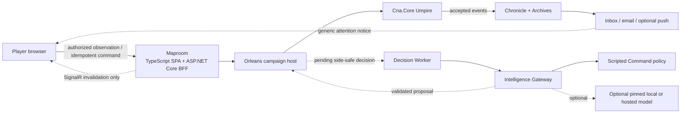

# Persona Models and Web Play Research Synthesis

**Status:** Owner-approved direction; implementation remains gated by the gameplay roadmap

**Date:** 2026-08-16

**Decision owner:** Project owner

## Inputs

- [Lightweight Persona Models Spike](lightweight-persona-models-spike.md)
- [webDiplomacy Product and Architecture Spike](webdiplomacy-product-architecture-spike.md)
- [Sandtable Web Play Shape Spike](sandtable-web-play-shape-spike.md)
- [Frontend Selection and webDiplomacy Success Deep Dive](frontend-and-webdiplomacy-success-deep-dive.md)

## Owner decisions recorded

| ID | Decision | Status |
| --- | --- | --- |
| `WEB-DEC-001` | Mature Sandtable is web-first and asynchronous-first, with local hot-seat delivered before hosted friend play. | Accepted 2026-08-16 |
| `WEB-DEC-002` | Maproom uses a TypeScript web client behind ASP.NET Core; Blazor is excluded in all forms and is not a future prototype option. | Accepted 2026-08-16 |
| `WEB-DEC-003` | webDiplomacy informs product ideas and success factors only. Its dated architecture, code, schemas, and assets are not implementation inputs. | Accepted 2026-08-16 |
| `WEB-DEC-004` | Maproom uses Vue 3 + Vite + strict TypeScript, Composition API, and Vue Router; React + Vite is the fallback and Nuxt/Next.js remain excluded. | Accepted 2026-08-16; bounded validation remains |
| `WEB-DEC-005` | Long campaigns default to low-frequency Campaign Cruise and may enter a faster Engagement Session only through explicit, time-boxed consent; correspondence deadlines never silently become minute-scale timers. | Accepted 2026-08-16 |
| `WEB-DEC-006` | Each side may use human control or deterministic Staff only through a versioned delegation with explicit scope and safe decision-boundary handoff. | Accepted 2026-08-16 |
| `WEB-DEC-007` | Workflow metadata and notifications are viewer-specific fog-of-war projections; readiness, deadlines, delegation, participation, and attention conditions are not inherently public. | Accepted 2026-08-16 |
| `AI-DEC-001` | Scripted personas remain required/default; the named lightweight families proceed only to a future measured evaluation, not product support. | Accepted 2026-08-16 |

## Executive recommendation

Adopt a **web-first, asynchronous-first mature product direction** without pulling Maproom ahead of
the current Umpire roadmap. The first hosted mode should be a private two-player campaign between
invited friends. A responsive TypeScript Maproom should sit behind a same-origin ASP.NET Core
player boundary, use ordinary HTTP for authoritative queries and commands, and use SignalR only to
tell an authorized client that it should refetch its side-safe projection.

Keep commander personas useful without making model inference a product dependency:

- the versioned scripted Command policy remains required, deterministic, and available everywhere;
- model-backed personas remain optional Intelligence proposals evaluated against the same legal
  candidates and effective profile;
- evaluate Ministral 3 3B/8B through one pinned `llama.cpp` runtime as the leading local family,
  with Qwen3.5 and Phi-4-mini as challengers;
- do not name a supported model until it passes the retained Sandtable-specific evaluation; and
- do not make a hosted asynchronous campaign depend on a player-owned model process being online.

webDiplomacy strongly validates the product category and several durable interaction patterns, but
not direct code or stack reuse. Its saved-draft/final-submit workflow, configurable pacing,
invite-only games, readiness, history, responsive map, pause/replacement, conformance testing, and
operator recovery are useful precedents. Sandtable should independently implement those ideas on
top of Chronicle, side-safe projections, typed legal actions, and idempotent Umpire commands.

## Reconciled target shape



The diagram is a logical ownership model, not a request for one deployable per box. Private alpha
should remain a small modular deployment. `Cna.Core` performs no browser, storage, clock, model, or
remote I/O.

## Key reconciliation: model placement depends on play mode

The model and web packets are individually compatible, but their combination introduces one
important operational distinction.

| Play/deployment mode | Dependable persona options | Reason |
| --- | --- | --- |
| Local hot-seat or desktop-hosted campaign | Scripted; optional local `llama.cpp` | The game and model can share one controlled machine and lifecycle. |
| Self-hosted or LAN campaign | Scripted; optional administrator-configured LAN endpoint | The campaign operator can keep the endpoint available and authenticated. |
| Sandtable-hosted asynchronous friend campaign | Scripted by default; optional server-configured hosted model later | A player browser/laptop may be closed when an autonomous decision becomes due. |
| Human request for optional advice while Maproom is open | Scripted immediately; later local or remote advice if a reviewed client/gateway path exists | Advice may wait on the present player, but it still cannot expose hidden state or become authoritative. |
| Headless War College/batch simulation | Scripted by default; explicitly provisioned evaluation workers | Cost, repeatability, and throughput matter more than generated prose. |

The initial custom endpoint belongs to the deployment owner, not arbitrary campaign data or a URL
supplied by a browser. Allowing the authoritative service to call player-supplied endpoints would
create SSRF, credential, availability, privacy, and support problems. A future client-assisted local
advice protocol would need its own authentication, redaction, stale-response, and browser/localhost
design; it is not implied by OpenAI API compatibility.

## Product decisions supported by the evidence

### Adopted direction

1. Mature Sandtable is a responsive web campaign, while the next playable milestone remains local
   hot-seat through the current roadmap.
2. The first hosted mode is invite-only asynchronous play between two known players.
3. Maproom receives only a viewer-specific observation, legal actions, concurrency value, and
   visibility-appropriate Chronicle projection.
4. Private drafts are mutable platform data; final submission is an explicit version-bound Umpire
   command.
5. HTTP query/command is the correctness path. SignalR, email, and push are advisory notices and
   never authoritative event delivery.
6. Scripted personas are a complete supported mode, not a degraded substitute for model inference.
7. Models are capability-tested, version-pinned Intelligence providers; normal players see product
   tiers such as Scripted, Local Balanced, and Local Quality rather than an unrestricted model list.
8. webDiplomacy is idea-level evidence only. Do not copy its AGPL-covered code or rights-sensitive
   assets into Sandtable without a deliberate license decision and qualified review.
9. Blazor is outside the Sandtable technology path. Future Maproom prototypes may use only the
   TypeScript ecosystem and browser-native map renderers.
10. Vue 3 + Vite is the accepted baseline for that TypeScript client. The later rules-lab
    prototype validates it against real contracts rather than reopening framework selection.
11. Campaign Cruise is the ordinary long-campaign rhythm. A faster Engagement Session is explicit,
    time-boxed, and consented; it cannot silently replace correspondence deadlines.
12. Human/Staff control is per side, versioned, scoped, audited, and effective only at a safe
    decision boundary. A control change never submits or adopts a private draft.
13. Workflow metadata is fog-sensitive. Readiness, deadlines, responsible actor, delegation,
    participation, and even an attention condition require viewer-specific projection and negative
    disclosure tests.

### Defer until evidence exists

- component library and SVG/Canvas/WebGL map renderer; Vue 3 + Vite is already the accepted
  framework baseline;
- exact local model, quantization, runtime build, and supported minimum hardware;
- automatic model downloading versus user-managed runtimes;
- hosted model provider, account/cost model, regions, and retention policy;
- public registration, matchmaking, ratings, tournaments, forums, and moderation staffing;
- exact deadline durations, the campaign's chosen timeout default, and calibrated
  grace/pause/vacation values; the governing policy and no-surprise transition rules are accepted;
- live spectator policy and public omniscient replay defaults;
- full offline command synchronization and native mobile applications; and
- persistence, identity, email, push, realtime-scale, or cloud vendors.

## Delivery sequence

These findings do not change the current gameplay dependency graph. They clarify what follows it.

```text
Current Core roadmap
  Content -> world -> observations -> legal actions -> turn preamble
  -> movement/contact -> combat -> playable local scenario

Then player delivery
  Maproom rules-lab prototype
  -> local hot-seat Maproom
  -> durable Chronicle/Archives and campaign host
  -> side-safe HTTP query + idempotent command boundary
  -> accounts, seats, invitations, private async resume
  -> Cruise/Engagement lifecycle + versioned human/Staff delegation
  -> inbox/email notices and SignalR invalidation
  -> PWA/push/Engagement Sessions after reliability evidence

Persona delivery, gated by the same foundations
  versioned persona projection + scripted Command policy
  -> retained 120-case War College corpus
  -> measured local model evaluation
  -> one optional supported local tier if a candidate passes
  -> hosted model only after privacy/cost/availability approval
```

The UI prototype should use the nine-hex rules laboratory and occur only when its observation and
legal-action contracts exist. It should test responsive map interaction, accessibility, reconnect,
stale drafts, and generated DTO ergonomics before committing substantial dependencies to the
accepted Vue frontend stack.

## Recommended owner defaults

Unless playtest evidence changes them, the research supports these defaults:

| Decision | Recommended default |
| --- | --- |
| First hosted audience | Invite-only campaigns between known players |
| First remote cadence | Asynchronous; deadline policy configurable and initially advisory |
| Timeout behavior during private alpha | Pause and request owner/player action; do not silently forfeit or generate a command |
| Long-campaign rhythm | Campaign Cruise; target roughly one or two meaningful human decisions per day, subject to playtest evidence |
| Faster interaction | Time-boxed Engagement Session only after explicit participation choices; no surprise timer acceleration |
| Session participation | Both human for live play, or human versus explicitly delegated deterministic Staff; an async/pause choice prevents fast cadence for that side's required decisions |
| Control handoff | Human/Staff changes take effect at a versioned safe decision boundary and invalidate incompatible stale submissions |
| Client/server split | TypeScript SPA behind same-origin ASP.NET Core BFF/API; no Blazor |
| Realtime | SignalR invalidation/presence only; refetch after reconnect |
| Browser session | Secure same-origin cookie, CSRF protection, server-derived campaign seat |
| Phone scope | Reports, decisions, invitations, deadlines, and bounded action entry; desktop/tablet remains the dense planning target |
| Accessibility | WCAG 2.2 AA, including keyboard/non-drag and semantic alternatives to the visual map |
| Live spectating | Off initially |
| Completed replay sharing | Private by default; explicit participant opt-in for public omniscient replay |
| Persona baseline | Scripted required and default |
| Leading evaluation family | Ministral 3 3B/8B, challenged by Qwen3.5 and Phi-4-mini |
| First managed local runtime | One pinned `llama.cpp` build if evaluation succeeds |
| Model distribution | Separate, consented, checksum-verified download or owner-managed runtime; not bundled in the base installer |
| Hosted Intelligence | Defer until after local corpus and privacy/cost decision |

## Risks that remain

- CNA may expose far more sequential decision barriers than Diplomacy. A naive asynchronous mapping
  could produce notification fatigue. Local playtests must measure action cadence and identify where
  deterministic Staff can batch routine execution without deleting player decisions.
- A TypeScript SPA creates a second toolchain and strong pressure to duplicate rules in the browser.
  Maproom must consume server-issued legal actions and keep client logic presentational.
- Model cards and general benchmarks do not predict persona competence. The named model ranking has
  low-to-moderate confidence until the Sandtable corpus runs on target hardware.
- Public multiplayer is an operations/community commitment, not merely an account screen. Invite-
  only play deliberately avoids launching moderation, matchmaking, ratings, and player-liquidity
  problems prematurely.
- Browser caches, realtime groups, notifications, telemetry, replays, and Intelligence prompts are
  all fog-of-war disclosure boundaries and require negative tests.
- Workflow metadata is also a disclosure boundary. A campaign must not reveal opposing readiness,
  delegation, session participation, deadline, or attention state merely because those fields are
  operational rather than military.
- Sandtable has no selected license. That should be resolved before public source reuse, packaged
  model distribution, or direct integration of copyleft code is considered.

## Confidence and next gate

**High confidence:** web-first asynchronous friend play; Umpire/Maproom separation; HTTP as truth;
side-safe projection; scripted fallback; no webDiplomacy code reuse; local gameplay before hosted
platform work.

**Moderate confidence:** TypeScript SPA as the mature Maproom shape; one small provider-neutral
private-alpha deployment; PWA/push value; Ministral as the leading evaluation family.

**Low-to-moderate confidence until measured:** named model/quantization ranking, minimum hardware,
the visible benefit of 8/9B over 3/4B, preferred decision deadlines, mobile full-order entry, and
spectator demand.

## Independent review reconciliation and traceability

A fresh-context review on 2026-08-16 requested that the final pacing discussion be retained before
this packet is treated as adopted. The review did not require an architectural reversal; it found
six traceability and lifecycle gaps. They are reconciled as follows:

| Review concern | Accepted decision | Canonical consequence | Delivery or verification gate | Status |
| --- | --- | --- | --- | --- |
| Campaign Cruise and Engagement Sessions | `WEB-DEC-005` | `WEB-017`, `WEB-021` | `WEB-PACE-EVAL-001` after the six-turn local MVP | Documented; implementation deferred |
| Dynamic human/Staff delegation and safe handoff | `WEB-DEC-006` | `WEB-018` | Versioned command/event and stale-submission tests before hosted alpha | Documented; implementation deferred |
| Workflow metadata as fog-sensitive | `WEB-DEC-007` | `WEB-019` | Negative projection tests for HTTP, realtime, inbox, email, push, and replay | Documented; implementation deferred |
| Vue decision incorrectly pending | `WEB-DEC-004` | Frontend baseline and rules-lab validation gate | Bounded Vue prototype after real observation/legal-action contracts | Reconciled |
| Long-campaign notification lifecycle | `WEB-DEC-007` | `WEB-020` | Durable inbox, deduplication, quiet-hours, failure, and offline-return tests before external push | Documented; implementation deferred |
| Pacing extrapolation from the six-turn scenario | `WEB-DEC-005` | `WEB-022` | `WEB-PACE-EVAL-001`; insufficient coverage cannot justify the 111-turn campaign | Documented; evidence pending |

With the direction approved, the next retained actions are:

1. mark this product/architecture direction accepted without moving Maproom earlier in the gameplay
   roadmap;
2. keep the model evaluation explicitly blocked on personas, observations, legal candidates, and
   the scripted controller;
3. add a future Vue Maproom prototype/spec checkpoint after the rules-laboratory action surface
   exists; the checkpoint validates the accepted baseline rather than selecting a framework;
4. decide Sandtable's repository/product license before publishing the product or redistributing
   model artifacts; webDiplomacy implementation reuse remains out of scope; and
5. execute `WEB-PACE-EVAL-001` after the local six-turn MVP and revisit numeric timeouts, public
   replay, and phone scope using real playtest evidence.
