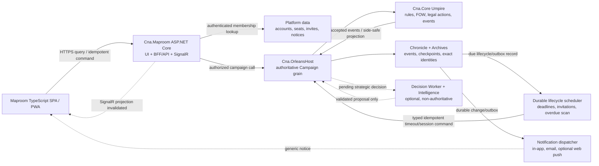

# Sandtable Web Play Shape Spike

**Status:** Owner-approved web direction; Blazor explicitly excluded

**Date:** 2026-08-16

**Decision owner:** Project owner

**Research work item:** `RSH-WEB-001`

## Executive recommendation

Make Sandtable a web-first campaign game whose primary public mode is a private, asynchronous
two-player campaign between invited friends. Use a responsive TypeScript single-page application
for **Maproom**, hosted behind a same-origin ASP.NET Core web/API boundary that authenticates the
player, resolves campaign membership, and calls the existing Orleans-hosted authoritative
campaign. Keep `Cna.Core` as the only Umpire and expose only side-safe observations, legal-action
IDs, command results, and derived Chronicle views to the browser.

Use Campaign Cruise as the normal low-frequency rhythm and explicit, time-boxed Engagement
Sessions for concentrated interaction. Human/Staff control remains per side and changes only at a
versioned safe decision boundary. Neither a notification nor connectivity state can imply consent,
delegate control, or silently accelerate a deadline.

Use ordinary HTTPS requests for queries and commands. Add ASP.NET Core SignalR as a best-effort
"campaign changed" wake-up channel while Maproom is open; it must not be an authoritative event
transport. A reconnect, missed notification, page reload, or second device always recovers by
requesting the latest authorized observation. Every command carries a client request ID and the
server-issued expected state version, and only an accepted Umpire command can append Chronicle
events.

Ship the web shape in layers:

1. retain the roadmap's local hot-seat Maproom as the first playable MVP;
2. add private accounts, invitations, durable saves, asynchronous resume, and in-app/email turn
   notices as the first hosted alpha;
3. add Engagement Sessions, installable PWA behavior, opt-in web push, and controlled replay or
   spectating only after authorization, fog, reconnection, and operations are proven; and
4. scale the modular deployment only when measured concurrency requires it.

This spike did not originally choose a cloud vendor, JavaScript framework, database, identity
provider, map renderer, or notification vendor. The follow-on
[frontend and webDiplomacy success deep dive](frontend-and-webdiplomacy-success-deep-dive.md)
recommended Vue 3 + Vite + strict TypeScript, which the owner accepted subject to later validation
in a small Maproom prototype. The map renderer and other vendors remain unselected.

**Owner decision, 2026-08-16:** Maproom will not use Blazor in any hosting mode, including Blazor
Server, WebAssembly, Hybrid, or an internal/admin exception. The retained comparison explains why
it was considered and rejected. Future prototypes may compare only still-unselected TypeScript
components and map renderers; they do not reopen the accepted Vue baseline.

## Decision question and boundary

This spike asks:

> In its mature form, how should Sandtable be playable as a web campaign while preserving the
> deterministic Umpire, strict fog of war, exact replay, low operating cost, and a quick path from
> local MVP to asynchronous friend play?

In scope:

- player modes and end-to-end journeys;
- Maproom client/server boundaries;
- SPA, Blazor, and server-rendered ASP.NET Core comparisons;
- live updates, reconnection, PWA/mobile, and deliberately limited offline behavior;
- accounts, invitations, deadlines, notifications, replay, and spectating;
- staged deployment, scaling, observability, security, privacy, and build-versus-buy seams; and
- spec-ready consequences for later product and technical design.

Out of scope:

- implementing Maproom or changing the accepted pre-alpha roadmap;
- choosing or installing UI, persistence, identity, email, push, cache, or cloud packages;
- selecting a hosting vendor or forecasting prices without measured workloads;
- model-backed personas, model hosting, or Intelligence-provider selection;
- ingesting published map art or changing the content-rights posture; and
- treating the separately researched webDiplomacy codebase as an architectural dependency.

The stop condition is a retained, source-backed recommendation with explicit owner choices and
enough consequences to seed a later Maproom/product specification. This packet does not authorize
implementation.

## Decision criteria

| Priority | Criterion |
| --- | --- |
| 1 | Preserve Umpire authority, replay, rules/content identity, and strict side-safe projection |
| 2 | Make asynchronous two-player friend campaigns dependable and easy to resume |
| 3 | Reach a local playable MVP before building public-platform infrastructure |
| 4 | Support a map-dense desktop/tablet experience and a useful phone companion |
| 5 | Recover safely from disconnects, duplicate requests, stale tabs, and multiple devices |
| 6 | Keep the initial deployment inexpensive and operationally understandable |
| 7 | Retain reversible seams for identity, notifications, storage, realtime scale-out, and hosting |
| 8 | Meet WCAG 2.2 AA as a product requirement rather than a late UI retrofit |

## Method and evidence labels

The research inspected the current repository boundaries and roadmap, then compared current
official ASP.NET Core, Blazor, SignalR, Orleans, PWA, identity, OpenTelemetry, and accessibility
guidance. Sources were observed on 2026-08-16. The option comparison evaluates product fit rather
than language preference.

Evidence is labeled throughout:

- **Documented fact:** directly stated by an official platform or standards source.
- **Repository observation:** directly visible in the current Sandtable repository.
- **Inference:** a Sandtable-specific conclusion drawn from facts and observations.
- **Unknown:** material uncertainty requiring a prototype, product decision, or workload evidence.

## Current baseline

### Repository observations

- [`Cna.Core`](../../src/Cna.Core/) is the only authoritative Umpire. The browser, host,
  Intelligence plane, and future persistence adapters cannot invent game state.
- [`Cna.AppHost`](../../src/Cna.AppHost/AppHost.cs) currently orchestrates the Orleans host,
  Decision Worker, and Intelligence Gateway. There is no Maproom or public web edge yet.
- [`Cna.OrleansHost`](../../src/Cna.OrleansHost/Program.cs) uses localhost clustering and exposes
  only a diagnostic root endpoint. Campaign grains, durable grain storage, Chronicle storage, and
  a public API remain future work.
- The [Intelligence protobuf](../../src/Cna.Intelligence.Contracts/Protos/intelligence.proto)
  already carries decision ID, state version, and ruleset hash, and accepts only bounded strategic
  observations rather than full authoritative state.
- The [pre-alpha roadmap](../roadmap/pre-alpha-roadmap.md) makes the first playable MVP local
  hot-seat, save/resume, deterministic replay, and side-safe legal actions. Hosted multiplayer is
  explicitly after that fidelity gate.
- [Content Pack v1](../specs/content-pack-v1.md) separates authoritative content from presentation
  metadata and explicitly forbids reusing the full content contract as a player DTO.

### Documented platform facts

- ASP.NET Core officially supports JavaScript SPAs, Blazor, and Razor Pages as distinct UI
  approaches. Razor Pages is server-rendered; Blazor can mix static server, interactive server,
  WebAssembly, and automatic render modes. [Choose an ASP.NET Core UI](https://learn.microsoft.com/en-us/aspnet/core/tutorials/choose-web-ui?view=aspnetcore-10.0),
  [Blazor fundamentals](https://learn.microsoft.com/en-us/aspnet/core/blazor/fundamentals/?view=aspnetcore-10.0)
- ASP.NET Core SPA integration supports current frontend command-line tooling, including Vite-style
  development integration. [ASP.NET Core SPA overview](https://learn.microsoft.com/en-us/aspnet/core/client-side/spa/intro?view=aspnetcore-10.0)
- Blazor Interactive Server requires a live server connection for interactivity; standalone
  Blazor WebAssembly can be cached and run offline as a PWA, at the cost of downloading the .NET
  runtime and application payload. [Blazor hosting models](https://learn.microsoft.com/en-us/aspnet/core/blazor/hosting-models?view=aspnetcore-10.0)
- SignalR's JavaScript client supports automatic reconnect but does not enable it by default. Its
  default reconnect schedule eventually stops, so an application still needs an explicit
  disconnected and resynchronization experience. [SignalR JavaScript client](https://learn.microsoft.com/en-us/aspnet/core/signalr/javascript-client?view=aspnetcore-10.0)
- Multi-server SignalR normally requires connection affinity and a scale-out mechanism; persistent
  connections also consume server connection and memory resources. A single-process host avoids
  that complexity initially. [SignalR hosting and scaling](https://learn.microsoft.com/en-us/aspnet/core/signalr/scale?view=aspnetcore-10.0)
- ASP.NET Core recommends cookie authentication for browser applications because the browser
  handles cookies without exposing them to JavaScript. Its built-in proprietary bearer tokens are
  intended for simple scenarios, not as a general identity-provider or token-server replacement.
  [Identity APIs for SPAs](https://learn.microsoft.com/en-us/aspnet/core/security/authentication/identity-api-authorization?view=aspnetcore-10.0)
- Cookie-authenticated state changes require a deliberate cross-site request-forgery defense;
  ASP.NET Core provides antiforgery services and middleware for that boundary.
  [Prevent CSRF attacks in ASP.NET Core](https://learn.microsoft.com/en-us/aspnet/core/security/anti-request-forgery?view=aspnetcore-10.0)
- SignalR can inherit the browser's cookie authentication, but hub authorization must be applied
  explicitly. Authorization may need rechecking during a long-lived connection because the
  connection principal is not continuously revalidated by default. [SignalR authentication and authorization](https://learn.microsoft.com/en-us/aspnet/core/signalr/authn-and-authz?view=aspnetcore-10.0)
- Orleans supports clustered grains, persistence, durable reminders, and streams. Durable
  reminders survive activation and most failures, but a reminder occurrence due while the cluster
  is down can be missed. [Orleans overview](https://learn.microsoft.com/en-us/dotnet/orleans/overview),
  [timers and reminders](https://learn.microsoft.com/en-us/dotnet/orleans/grains/timers-and-reminders),
  [grain persistence](https://learn.microsoft.com/en-us/dotnet/orleans/grains/grain-persistence/)
- Offline PWA support requires more than caching an application shell. Authenticated editing needs
  explicit identity, queueing, conflict, and synchronization behavior; Microsoft warns that
  offline support adds significant complexity. [Blazor PWA guidance](https://learn.microsoft.com/en-us/aspnet/core/blazor/progressive-web-app/?view=aspnetcore-10.0)
- Web Push can deliver to an opted-in web application when it is not foregrounded, through the
  Push, Notifications, and Service Worker APIs. Subscription endpoints require CSRF protection.
  [MDN Push API](https://developer.mozilla.org/en-US/docs/Web/API/Push_API),
  [push notification practices](https://developer.mozilla.org/en-US/docs/Web/API/Push_API/Best_Practices)
- WCAG 2.2 is the current W3C Recommendation and W3C advises using the latest WCAG version. Level
  AA includes requirements relevant to a dense map UI, including focus visibility, alternatives to
  dragging, target size, status messages, and accessible authentication. [WCAG 2.2](https://www.w3.org/TR/WCAG22/),
  [what changed in WCAG 2.2](https://www.w3.org/WAI/standards-guidelines/wcag/new-in-22/)
- The repository's existing Aspire Service Defaults pattern can emit OpenTelemetry logs, traces,
  and metrics and can export them without binding the application to one telemetry backend.
  [Aspire and OpenTelemetry](https://learn.microsoft.com/en-us/dotnet/fundamentals/networking/telemetry/metrics#collect-metrics-with-aspire)

## Product modes

| Mode | Product role | First useful stage | Important boundary |
| --- | --- | --- | --- |
| Local hot-seat | Two people share one trusted device | First playable MVP | No public accounts or network dependency |
| Private asynchronous friend campaign | Primary hosted mode; players act hours or days apart | Hosted alpha | Durable resume, turn notices, deadlines, side-safe state |
| Engagement Session | A consented, time-boxed burst in an existing Cruise campaign | After async reliability | Faster cadence applies only to sides that explicitly choose human/live or deterministic Staff participation |
| Solo versus scripted Command | Learning, testing, and fallback | After legal actions exist | Deterministic policy remains authoritative input |
| Solo versus model-assisted persona | Optional flavor and strategic judgment | Later | Intelligence sees only redacted candidates and may fail safely |
| Replay / War Diary | Review completed or authorized history | MVP then mature | Projection and visibility policy are explicit |
| Spectator | Social viewing | Later public beta | Active-game delay/redaction; no hidden Chronicle access |
| Team command | Multiple people share a side | Mature, if demanded | Requires role, coordination, and hidden-order ownership design |

### Primary hosted journey

1. A signed-in player creates a campaign from an admitted ruleset, exact content pack/scenario,
   and a time-control policy.
2. The creator generates a single-use, expiring invitation for the unoccupied opposing seat.
3. The friend accepts after authentication. The server binds the account to the campaign seat;
   the browser never declares which side it is authorized to view.
4. Maproom loads the player's side-safe observation, phase explanation, legal-action set, and
   public campaign metadata. Private drafts may be stored separately from authoritative state.
5. The player submits one server-issued legal action with a client request ID and expected state
   version. The Umpire either emits authoritative events or returns a typed rejection.
6. Only after durable acceptance does the web boundary notify connected clients that an authorized
   projection may have changed. Each client fetches its own new side-safe observation.
7. A disconnected player later follows an in-app, email, or opt-in push notice, authenticates, and
   resumes from the latest projection. No socket backlog is required for correctness.
8. At completion, players can inspect a visibility-appropriate replay and export an exact campaign
   identity/history package when Archives supports it.

### Campaign Cruise and Engagement Session lifecycle

Campaign Cruise is the default rhythm for long-lived campaigns. It targets roughly one or two
meaningful human decisions per day while allowing explicitly delegated deterministic Staff to
resolve routine eligible decisions. That target is a hypothesis to measure, not a promise that
changes CNA's rules or removes mandatory decisions.

An Engagement Session is a faster interaction window inside the same campaign, not a separate game
mode or authority path:

1. The Umpire or host records a side-safe attention condition when the current decision graph may
   benefit from a concentrated session. The condition itself is viewer-projected because revealing
   its cause or affected actor may expose hidden operations.
2. Each side receives an invitation with a proposed start, known duration, response deadline, and
   its campaign's already-selected timeout policy. An invitation cannot shorten an existing
   correspondence deadline.
3. Each side explicitly chooses `HumanLive`, `StaffDelegated`, `RemainAsync`, or `PauseRequested`.
   Silence is not consent. An async or pause choice prevents rapid cadence for decisions controlled
   by that side.
4. Both `HumanLive` choices permit a live session. One `HumanLive` choice plus an explicit
   `StaffDelegated` choice permits a hybrid session. Both delegated sides may permit deterministic
   automatic progression. These combinations do not change rules, legal actions, or authority.
5. During an active session, commands still use the ordinary idempotent Umpire path. SignalR only
   supplies presence, invalidation, and deadline hints. Reconnect requires a fresh authorized
   observation before submission is re-enabled.
6. The session ends at its agreed boundary, an explicit pause, or a safe decision boundary after
   expiry. It then returns to Campaign Cruise unless every required participant separately consents
   to a time-boxed extension.

The campaign records a versioned lifecycle such as `Cruise`, `EngagementProposed`,
`EngagementActive`, `ReturningToCruise`, or `Paused`. Per-side participation is separate from the
campaign lifecycle. External schedulers request transitions with typed, idempotent commands; only
the Umpire accepts the transition and emits its authoritative event.

No state transition may silently convert a day-scale correspondence deadline into a minute-scale
timer. Chat, voice, typing indicators, and cursor sharing remain optional product features and are
never required for game correctness.

### Human and deterministic Staff handoff

Control is explicit per side and never inferred from connectivity or notification delivery:

- a delegation names its scope: one decision, the current Engagement Session, a named phase, or
  until revoked; an unspecified open-ended delegation is invalid;
- the command carries the decision/campaign identity, expected state version, policy version,
  controller identity, scope, and safe boundary at which it may become effective;
- changing controller does not submit, translate, or adopt a private human draft. Incompatible
  drafts remain private but are marked stale and cannot later be submitted against a new version;
- reclaim, revoke, timeout delegation, session-end handoff, and replacement are authoritative,
  audited transitions. Each takes effect only between decisions, never while adjudication is in
  progress;
- a late human or model proposal prepared before the handoff rejects as stale and emits no game
  event; and
- deterministic Staff output is pinned to its policy/configuration identity and replays through
  the same legal-action and event path as a human command.

Private-alpha campaigns default to `remind -> grace -> pause`. A simulation-first campaign may
select `remind -> deterministic Staff` before play. Timeout policy cannot be changed retroactively
for an already-open decision without explicit affected-player consent and an audited event.

## Recommended logical architecture



`Cna.Maproom` is one logical player-facing boundary, not a mandate for a separately scaled
microservice. It can host the compiled SPA, browser APIs, authentication endpoints, and SignalR in
one ASP.NET Core deployment. It uses an Orleans client and has no direct path to mutate Chronicle
or campaign snapshots.

Platform data is distinct from campaign truth:

- accounts, campaign memberships, invitation delivery, notification preferences, and device push
  subscriptions are platform records;
- ruleset/content identity, commands, events, authoritative clocks/turn state, Cruise/Engagement
  lifecycle, per-side controller assignment, and replay are Umpire/Chronicle records; and
- email delivery receipts or presence are operational facts, not campaign history.

## Authoritative request, event, and observation flow

```text
GET authorized observation
  browser cookie -> Maproom authenticates user
  -> Maproom resolves user to campaign seat/role
  -> campaign activation asks Cna.Core for that role's projection
  -> browser receives only observation + legal actions + concurrency value

POST command
  browser sends clientRequestId + legalActionId + parameters + expectedStateVersion
  -> Maproom checks CSRF, rate limit, membership, campaign status
  -> campaign activation deduplicates request and invokes Cna.Core
  -> rejected: typed rejection, zero events
  -> accepted: append authoritative events, update checkpoint, then acknowledge

Notify
  accepted history produces a projection-change marker/outbox item
  -> SignalR sends a small role-safe invalidation to connected authorized clients
  -> notification dispatcher sends a generic turn/status notice to opted-in channels
  -> clients refetch; notifications never contain hidden state

Reconnect / resume
  client treats realtime messages as hints
  -> fetch latest authorized observation and legal actions
  -> replace local server-derived state; retain only compatible private draft input
```

### Required invariants

- The authenticated account-to-seat mapping is resolved on the server. A browser-provided side ID
  is never authority.
- Maproom never receives a complete `ContentPackDefinition`, campaign snapshot, random cursor, or
  opposing hidden facts merely because the server owns them.
- A client request ID deduplicates network retries. Repeating an accepted request returns the
  recorded result and cannot roll, resolve, or append twice.
- Expected state version and legal-action membership are revalidated within the authoritative
  campaign turn.
- SignalR group membership is server-authorized and is rechecked when membership changes. A hub
  connection does not grant access to query or command endpoints.
- Chronicle append/durable acceptance precedes acknowledgement and user notification. A failed
  notification cannot roll back an accepted game event.
- Realtime payloads are side-safe invalidations or side-safe deltas, never raw authoritative
  events. Start with invalidation-and-refetch because it has the smallest disclosure surface.
- Reconnection never relies on SignalR retaining every message. Durable state is recovered through
  the normal authorized query path.
- Workflow metadata follows the same viewer-specific projection boundary as military state. A
  responsible actor, readiness state, deadline, controller, delegation scope, attention condition,
  or Engagement participation is never public merely because it coordinates work.
- No scheduler, notification worker, browser connection, or provider can change a campaign mode,
  controller, deadline outcome, or timeout result without an accepted typed Umpire command.

## Web client options

| Option | Strengths for Sandtable | Material risks | Best use | Decision |
| --- | --- | --- | --- | --- |
| ASP.NET Core + TypeScript SPA | Mature map/visualization ecosystem; direct browser APIs; strong PWA and responsive support; frontend can evolve independently behind versioned DTOs | Two languages/toolchains; explicit API contract/code generation; custom map accessibility requires discipline | Main Maproom | **Recommend** |
| Blazor Web App / WebAssembly | C# end to end; shared validation/view-model code; per-component render modes; built-in .NET hosting integration | Interactive Server loses interactivity on disconnect and consumes persistent circuits; WebAssembly startup/published performance and advanced-map interop add risk without a product advantage for this project | None | **Excluded by project owner; do not prototype or introduce** |
| Razor Pages + progressive JavaScript | Smallest deployment/tooling surface; excellent HTML-first forms, account pages, reports, and simple admin; accessible defaults are easier | Pan/zoom/select/draft/highlight map interaction becomes a growing JavaScript island or repeated full-page requests | Account/lobby/admin/archives pages or a thin shell | Complement, not the mature map client |

### Why the TypeScript SPA wins

**Inference:** Maproom is closer to a long-lived graphical application than a document site. It
needs map panning/zooming, selectable formations, legal-action previews, side panels, overlays,
private drafts, reconnect state, replay scrubbing, and responsive layouts. A TypeScript SPA makes
those browser-native interactions straightforward while leaving all rules and authority in C#.

This is not a recommendation to duplicate Umpire logic in TypeScript. The SPA may implement
presentation geometry, animation, optimistic selection, and draft editing. It must not calculate
whether a move is legal, infer hidden data, resolve combat, or predict authoritative random
results. Generated or hand-versioned DTO clients should preserve the server boundary.

The follow-on `RSH-WEB-002` comparison recommends Vue 3 + Vite over React + Vite, with React retained
as the fallback. The owner accepted that recommendation; the later nine-hex rules-laboratory
prototype validates Vue against the following measures rather than reopening a broad framework
survey:

- first useful render and production bundle size;
- keyboard and screen-reader interaction;
- map selection/pan/zoom on desktop, tablet, and phone;
- SignalR reconnect and stale-action handling;
- contract generation and testing ergonomics; and
- SVG/DOM performance before considering Canvas or WebGL.

Start with semantic HTML plus SVG for the small map. If the published theater proves too large,
Canvas/WebGL may render the visual layer, but a synchronized keyboard-operable formation list,
hex inspector, action list, focus model, and text alternatives remain required.

## PWA, mobile, reconnect, and offline policy

### Adopt

- Responsive browser UI as the only initial client.
- Desktop and tablet as the primary full Maproom experience.
- A phone layout that can read dispatches, inspect the current situation, manage invitations and
  deadlines, and submit bounded decisions without requiring precision map dragging.
- Installable PWA shell, background update behavior, and opt-in web push after hosted async play is
  reliable.
- Automatic SignalR reconnect plus a visible manual retry/resync path.
- Local private drafts that are tagged with campaign, account, seat, and expected state version.

### Deliberately defer

- Full offline authoritative play or a general queued-command synchronization engine.
- Background submission of game commands.
- Native iOS/Android applications or hybrid native wrappers.
- Caching complete Chronicle history, full content, or another side's observations.

**Inference:** The safe first offline behavior is "loads and reads, but does not adjudicate." Cache
the application shell and, only with explicit user consent, the most recent side-safe observation
for a private device. A player may edit a draft while disconnected, but submission is disabled
until Maproom reauthenticates, refetches current legal actions, and confirms that the draft still
targets the current state. Stale drafts are retained as notes rather than silently transformed
into different commands.

Offline caches must be partitioned by stable account and campaign identity, encrypted only if a
browser-supported design is later justified, and cleared on sign-out or explicit "forget this
device." Shared-device hot-seat mode should default to no persistent private observation cache.

## Accounts, invitations, and authorization

Use an internal stable `UserId` and campaign membership/seat records that do not depend on a
specific identity provider. Prefer same-origin, `HttpOnly`, `Secure`, appropriately `SameSite`
cookie sessions for browsers. Apply antiforgery protection to state-changing HTTP requests and do
not store browser bearer tokens in local storage.

Invitation behavior should be part of Sandtable's platform domain because it assigns scarce,
game-relevant roles:

- opaque, high-entropy token; only a hash is stored;
- single use, explicit expiry, revocable by the campaign owner;
- binds to one campaign and one available role, never an arbitrary side supplied at acceptance;
- acceptance requires authentication and an explicit confirmation screen;
- accepting, revoking, replacing, or leaving a seat is audited;
- responses avoid revealing whether unrelated accounts or campaigns exist; and
- no invitation URL contains scenario secrets, side-safe observations, or a reusable session.

For a private alpha, ASP.NET Core Identity cookie accounts can be sufficient if registration,
verification, recovery, and abuse scope remain intentionally narrow. Before public registration,
decide whether to integrate a standards-based external identity provider instead of owning
password security, account recovery, federation, and bot defense. Preserve internal user IDs so
that decision stays reversible.

Authorization is resource-based, not merely role-name based. Every campaign query, command,
SignalR subscription, replay request, export, and notification preference change checks the
current account's relationship to that campaign and the requested projection policy.

## Time controls, deadlines, and notifications

Treat time controls as platform policy that can cause an explicit Umpire command, never as an
ambient `DateTime.Now` read inside `Cna.Core`.

- Persist deadlines as absolute UTC instants plus the named time-control policy/version.
- Store a user's time-zone preference only for presentation; show the absolute date, local zone,
  and remaining duration together around daylight-saving boundaries.
- Make private-alpha deadlines advisory. Do not auto-forfeit or auto-select an action until the
  policy, grace periods, pause/holiday behavior, and deterministic fallback command are specified.
- Select timeout behavior before play and retain its policy version with each opened decision.
  Campaign Cruise and Engagement Sessions may use different configured durations, but entering a
  session cannot shorten an already-open deadline without explicit affected-player consent.
- If a mature policy expires, a scheduler submits an idempotent, policy-versioned command to the
  campaign. The resulting event records the authoritative outcome for replay.
- Orleans reminders can wake campaign work, but because an occurrence may be missed during an
  outage, also query durable overdue deadlines on startup/periodically. The database record, not a
  live timer, is the source of scheduling truth.

Use a durable in-app notification inbox as the canonical user-facing notice. Email is the first
out-of-app channel because it is widely reachable; web push is optional and permission-based.
Notification payloads should say only that attention is needed or a campaign changed, then deep
link to an authenticated query. Do not put opponent actions, hidden units, private plan text,
invitation tokens, or long-lived credentials in email subjects, lock-screen push text, analytics,
or URLs.

Long campaigns need a notification policy rather than an unbounded stream of per-event messages:

- routine Cruise changes may be batched into a player-configurable digest, while an actual
  player-owned decision, session invitation, consent deadline, session start/end, delegation
  transition, pause, or delivery failure has its own typed notice;
- quiet hours suppress ordinary out-of-app delivery. Only a category the player explicitly marked
  urgent may bypass them, and an Engagement invitation is not urgent merely because another player
  is available;
- every logical notice has a stable deduplication key across inbox, email, push, retries, and
  multiple devices. Delivery receipts are operational records and cannot acknowledge a game
  decision or imply player consent;
- an offline return reads the durable inbox and current authorized projection rather than replaying
  every transient push or SignalR message;
- escalation follows the campaign policy, such as reminder then grace then pause or deterministic
  Staff. Repeated invitations, deliberate timeout, asymmetric availability, and notification spam
  require rate limits, decline/mute controls, and an audited dispute or replacement path; and
- the notice builder receives an already viewer-safe workflow projection. It cannot inspect the
  opposing decision merely to generate more descriptive copy.

## Replay, spectators, and War Diary

Chronicle remains machine truth. Maproom replay is a derived view with an explicit visibility
policy:

- **player replay:** shows what that side was entitled to know at each point, plus information
  legitimately revealed later;
- **completed omniscient replay:** available to participants after completion only if the campaign
  policy permits it;
- **public replay:** explicit owner opt-in after completion and after removing account/private
  metadata;
- **active spectator:** disabled initially; later use a time-delayed public projection or a named
  side-safe observer policy, never the raw Chronicle; and
- **War Diary:** human-readable derived narrative that can be regenerated and is never used for
  replay authority.

An export must name contract versions, campaign ID, exact ruleset/content identities, and the
visibility level of the export. Public sharing is a separate action from saving a campaign.

## Staged product and deployment shape

| Stage | Player capability | Deployment shape | Exit evidence |
| --- | --- | --- | --- |
| Current / pre-alpha | Developer harness and deterministic Core | Existing Aspire app; no Maproom | Complete movement/contact/combat laboratory loop |
| First playable MVP | Local hot-seat scenario, save/resume, replay | One development machine; Maproom and Orleans may remain separate processes under Aspire | Two local players finish the selected scenario with exact replay |
| Private hosted alpha | Invite one friend, async resume, accounts, durable inbox/email | One region and small deployment: Maproom/API, Orleans host, durable storage; optional worker/gateway disabled or scripted | Authorization/fog/reconnect/backup-restore tests plus real friend campaigns |
| Hosted beta | Async plus Engagement Sessions, responsive/PWA shell, support tooling | Still prefer few deployables; add replicas/backplane only when connection and latency metrics require it | Load tests, abuse controls, SLOs, incident/restore drill, accessibility audit |
| Mature public service | Optional push, controlled spectators/replays, personas, larger concurrency | CDN for public static assets; horizontally scaled web edge and Orleans cluster; provider-neutral realtime/persistence seams | Measured capacity, retention/moderation policies, multi-instance failure tests |

### Scaling and cost posture

- Optimize for active commands and connected sessions, not total registered campaigns. Inactive
  asynchronous campaigns should not require a permanently active grain or socket.
- Begin with one web instance and one Orleans silo on the same host or small environment if
  reliability permits, while retaining separate process boundaries in Aspire. Add high
  availability only when hosted alpha expectations justify it.
- SignalR is optional for a closed browser. A low-frequency notification/inbox path and ordinary
  HTTP resume keep asynchronous campaigns usable without an always-open connection.
- Add a SignalR backplane or managed realtime service only when there are multiple web instances.
  Do not select that vendor seam before deployment evidence.
- Keep model inference off by default for headless tests and ordinary campaigns. Persona workloads
  must not determine the base game's hosting cost or availability.
- Store immutable content and completed history efficiently, but do not introduce hot caches until
  observation latency or database load is measured.

## Security, fog, privacy, and abuse considerations

| Risk | Required control |
| --- | --- |
| IDOR / campaign enumeration | Opaque IDs where useful and resource authorization on every request; indistinguishable unauthorized/not-found response policy |
| Client claims an opposing side | Resolve account-to-seat server-side; never accept client side as authority |
| Hidden-state disclosure in DTOs | Dedicated side-safe projection contracts and negative serialization/integration tests for both sides |
| Hidden-state disclosure in realtime | Small role-safe invalidation; authorize groups server-side; no raw Chronicle broadcast |
| Workflow metadata discloses hidden activity | Viewer-specific projection for readiness, actor, deadline, controller, delegation, attention, and Engagement participation; negative tests for presence and absence of every field |
| Hidden-state disclosure through caches | Same-origin private caching, no shared/CDN cache for observations, clear account-scoped stores on logout |
| Duplicate/stale commands | Client request ID, expected state version, legal-action membership, durable deduplication |
| CSRF against cookie session | ASP.NET Core antiforgery on commands, invite acceptance, settings, and push-subscription endpoints |
| XSS steals private observations | Contextual encoding, Content Security Policy, dependency review, no bearer token in browser storage |
| Long-lived SignalR access after role change | Reauthorize subscriptions/methods and close affected connections on membership/auth changes |
| Invite theft or guessing | Hash strong single-use tokens, expire/revoke, rate limit, avoid logging token URLs |
| Notification/lock-screen leakage | Generic text and authenticated deep link; no hidden game detail in provider payloads |
| Notification timing/frequency leaks activity | Batch routine Cruise notices, avoid opponent-correlated wording, deduplicate across channels, and test side-by-side observable timing metadata |
| Engagement invitation or timeout abuse | Rate limits, quiet hours, decline/mute, no consent by silence, pre-agreed timeout policy, audited pause/replacement/dispute path |
| Replay/spectator leakage | Named projection policy, completion gate, explicit public opt-in, no default omniscient sharing |
| Logs/traces leak game data | Log IDs, versions, issue codes, timings, and hashes—not observations, commands, cookies, tokens, or persona prompts |
| Public API abuse | Per-account/campaign rate limits, bounded payloads, quotas on campaign/invite creation, load testing |
| Account/privacy overcollection | Minimum profile: stable ID, display name, contact/identity linkage, locale/time zone, notification consent; documented retention/export/delete policy |

The service cannot provide end-to-end secrecy from its operator because the Umpire must adjudicate
the complete game. This limitation should be explicit. Encryption in transit and at rest protects
against network/storage exposure but does not make the authoritative host blind to game state.

## Accessibility and interaction requirements

Target WCAG 2.2 AA for Maproom, account, lobby, and replay surfaces. In particular:

- every map operation has a keyboard and non-drag alternative;
- focused hexes, units, actions, dialogs, and overlays remain visible and are not obscured;
- color is never the only carrier of side, terrain, contact, supply, or action status;
- live phase/reconnect/command status is exposed through appropriate status semantics without
  stealing focus;
- target sizes and zoom work on touch devices;
- the map has a synchronized semantic inspector/list/table view, not one inaccessible canvas;
- animation and automatic replay respect reduced-motion preferences and offer pause/step controls;
- deadlines are expressed as text and not only a shrinking color bar; and
- authentication does not require inaccessible cognitive tests.

Accessibility acceptance must include automated checks, keyboard walkthroughs, screen-reader
testing, zoom/reflow, reduced motion, high contrast, and both phone and desktop layouts. A canvas
or WebGL renderer does not waive the semantic UI requirement.

## Observability and operations

Extend the existing Service Defaults/OpenTelemetry boundary rather than adding a vendor SDK to
domain code. Correlate one browser request, Maproom authorization, Orleans call, Umpire decision,
Chronicle append, projection update, and notification dispatch with safe identifiers.

Initial metrics should include:

- query and command latency by outcome/issue code;
- accepted, rejected, stale, duplicate, and unauthorized commands;
- SignalR connected/reconnecting/disconnected counts and resync duration;
- campaign activation, storage, snapshot, replay, and projection latency;
- notification enqueue/delivery/failure counts without message bodies;
- overdue deadline and scheduler catch-up counts;
- content/ruleset mismatch and invalid-history failures; and
- backup age, restore-test outcome, and queue/outbox depth.

Define service-level objectives only after private-alpha measurements. Before public beta, perform
backup/restore drills, a multi-instance reconnect test, dependency and security review, accessibility
audit, and an incident runbook exercise. Health endpoints must distinguish liveness from readiness;
a failed optional Intelligence provider must not mark authoritative play unavailable.

## Build-versus-buy seams

### Sandtable must build and own

- Umpire adjudication, deterministic policies, fog projection, legal actions, and replay;
- campaign membership/seat semantics and invitation state transitions;
- rules/content admission and exact identity display;
- authoritative command/deduplication contracts and side-safe query contracts;
- deadline policy and the command produced by expiry;
- Chronicle-derived replay/War Diary visibility policies; and
- Maproom's game-specific interaction, explanations, and accessibility model.

### Keep replaceable and consider buying later

| Capability | Stable Sandtable seam | Buy/host decision trigger |
| --- | --- | --- |
| Identity federation/account recovery | Internal `UserId` plus claims mapping | Public registration, social login, passkeys, support burden |
| Transactional email | `INotificationChannel`-style adapter plus durable notice record | Private hosted alpha |
| Web push delivery | Push-subscription adapter; generic payload | Demonstrated mobile re-engagement need |
| Realtime scale-out | SignalR abstraction/backplane configuration | More than one web instance or connection limits |
| Relational/object storage | Chronicle/Archives and platform repository interfaces | Durability/backup requirements; select on measured access patterns |
| Telemetry backend | OpenTelemetry export | Hosted operations and alerting |
| CDN/WAF/DDoS edge | Standard HTTPS/static asset boundary | Public traffic and abuse exposure |
| Model/runtime providers | Existing Intelligence provider boundary | Optional persona decision, separate spike |

Do not wrap ASP.NET Core, Orleans, or a database behind speculative generic frameworks. The seams
above exist where ownership, failure mode, privacy, or vendor lifecycle genuinely differs.

## Explicit non-goals for the first hosted release

- Public matchmaking, rankings, ladders, tournaments, or monetization.
- Team command, diplomacy/chat, forums, user-generated scenarios, or mod distribution.
- Native mobile applications or full offline multiplayer synchronization.
- Public active-game omniscient spectating.
- Model-backed personas as an availability requirement.
- Multiple regions, active-active campaign writes, or automatic cross-region failover.
- Microservice-per-module deployment, Kubernetes by default, or a mandatory managed cloud service.
- Copied original board/counter artwork or any change to the repository's rights gate.
- SEO-driven server rendering for authenticated Maproom screens; public project pages can remain
  separate from the game client.

## Spec-ready consequences

The following accepted planning consequences seed a later web-play specification. They are not an
authorization to implement Maproom ahead of the game-core roadmap:

| ID | Normative consequence |
| --- | --- |
| `WEB-001` | Maproom is a non-authoritative client; every authoritative state change is an accepted versioned Umpire command and event. |
| `WEB-002` | The server derives campaign seat/role from the authenticated membership and returns only a dedicated side-safe observation and legal-action contract. |
| `WEB-003` | Every command carries a unique client request ID, server-issued legal-action ID, expected state version, and contract version; retries are idempotent and stale commands emit no event. |
| `WEB-004` | Realtime delivery is advisory. A reconnect or missed message restores state through an authorized observation query and cannot require socket-message replay. |
| `WEB-005` | SignalR subscriptions, queries, commands, replay, exports, and notifications use resource authorization for the current campaign relationship. |
| `WEB-006` | Browser authentication defaults to a same-origin secure cookie with CSRF protection; no long-lived browser token is stored in Web Storage. |
| `WEB-007` | The first hosted product mode is private invited asynchronous two-player play; local hot-seat remains available and Engagement Sessions use the same authoritative command path. |
| `WEB-008` | Offline v1 may cache the app shell and an explicitly opted-in side-safe observation and private draft, but cannot adjudicate or silently queue authoritative commands. |
| `WEB-009` | Invitations are single-use, expiring, revocable, hashed, campaign/role-scoped tokens whose acceptance is authenticated and audited. |
| `WEB-010` | Deadline policy is versioned platform input; expiry produces an idempotent explicit command and never reads ambient wall time inside `Cna.Core`. |
| `WEB-011` | In-app notifications are durable; email/push payloads remain generic and require an authenticated fetch for game detail. |
| `WEB-012` | Replay and spectator outputs use named visibility policies. Public sharing is opt-in and raw authoritative Chronicle data is never a browser spectator feed. |
| `WEB-013` | Maproom targets WCAG 2.2 AA and supplies keyboard, non-drag, non-color, reduced-motion, semantic-map, and responsive alternatives. |
| `WEB-014` | Observation caches and telemetry cannot contain full content/world state, opposing hidden facts, tokens, invitation URLs, or raw command/observation bodies. |
| `WEB-015` | Initial hosting remains a small provider-neutral deployment; horizontal web/Orleans/realtime scale-out is gated by measured workload and failure tests. |
| `WEB-016` | Optional Intelligence failure or disablement cannot make campaign queries, commands, saves, or replay unavailable. |
| `WEB-017` | Long campaigns default to Campaign Cruise. An Engagement Session has an explicit proposal, per-side participation choices, known duration, safe expiry/extension, and return-to-Cruise transition. |
| `WEB-018` | Human/Staff delegation is per side, explicitly scoped, versioned, audited, and effective only at a safe decision boundary; controller changes never make private drafts authoritative and stale submissions emit no event. |
| `WEB-019` | Workflow metadata uses viewer-specific projection and negative tests. Readiness, responsible actor, deadline, controller, delegation, attention conditions, and Engagement participation are not implicitly public. |
| `WEB-020` | Long-campaign notifications support durable inbox state, Cruise digests, quiet hours, typed session/delegation notices, cross-channel deduplication, delivery failure, authenticated offline return, and abuse controls. |
| `WEB-021` | Campaign timing never silently accelerates. A faster cadence or shortened open deadline requires the affected player's explicit, recorded consent under a versioned policy. |
| `WEB-022` | The six-turn local MVP must measure decision cadence and interaction bursts before Cruise/Engagement assumptions are generalized to longer scenarios; insufficient scenario coverage remains an explicit evidence gap. |

Recommended later implementation lanes, after the current game-core roadmap reaches its named
gates:

```text
MAP-SPEC-001   Maproom product flows, DTOs, authorization, accessibility, and UI prototype
HOST-001       campaign grain + durable Chronicle/Archives + exact content admission
WEB-AUTH-001   accounts, campaign membership, invitations, session/CSRF policy
WEB-OBS-001    HTTP observation/legal-action query and negative fog integration tests
WEB-CMD-001    idempotent authoritative command endpoint and durable acceptance boundary
WEB-RT-001     SignalR invalidation, reconnect, multi-device, and role-revocation tests
WEB-PACE-001   Cruise/Engagement lifecycle, consent, deadline, delegation, and scheduler contracts
WEB-ASYNC-001  inbox, digest/email adapter, quiet hours, deduplication, resume/deep links
WEB-PWA-001    installability, explicit safe cache, push opt-in, published offline testing
WEB-REPLAY-001 player/completed/public visibility policies and export contracts
```

These lanes must not pull Maproom ahead of the roadmap's complete Umpire combat skeleton merely to
produce a visually polished but mechanically incomplete game.

## Confidence, limitations, and unknowns

### Confidence

- **High:** web-first, asynchronous-first private campaign is compatible with Sandtable's
  deterministic, replayable, turn-based domain.
- **High:** TypeScript SPA plus ASP.NET Core BFF/API is the best current fit for the mature map UI.
- **High:** HTTP as truth plus SignalR invalidation/reconnect is safer than treating a socket as an
  event log.
- **High:** same-origin browser cookies, server-derived membership, and dedicated observations are
  the correct initial security boundary.
- **Medium:** one small hosted deployment will cover private alpha; actual capacity depends on
  observation size, reconnect behavior, and campaign activity.
- **Medium:** PWA installation and generic push will improve async play; demand and browser-specific
  behavior need validation with players.

### Unknowns

- Whether the real rules-laboratory contract exposes a material Vue-specific problem; the component
  library and map renderer remain unselected.
- Published-map scale, overlay density, and whether SVG remains performant before Canvas/WebGL is
  needed.
- Whether players prefer 24-hour, 48-hour, 72-hour, no-deadline, or scheduled-session defaults;
  and what pause/grace/absence rules feel fair.
- Whether a phone should support complete order entry or serve mainly as a reports/notification
  companion.
- Whether active spectators are desirable enough to justify delay/redaction complexity.
- Public-registration, moderation, abuse, support, retention, and deletion requirements.
- Hosted concurrency, bandwidth, storage, email, and push volumes; no responsible vendor/cost
  choice is possible before private-alpha measurements.
- Whether self-managed ASP.NET Core Identity remains acceptable after private alpha or an external
  standards-based identity provider is preferable.
- How published-scenario rights constrain hosted distribution and public replay imagery.

The Blazor exclusion is an owner constraint, not an open research question. Other evidence that
would change the remaining recommendation includes user research showing the game is primarily
solo/local rather than asynchronous multiplayer, or a map workload that cannot be handled by the
browser rendering approaches considered.

## Owner decisions recorded and remaining

The project owner accepted the following directions on 2026-08-16:

1. **Product:** private invited asynchronous two-player play is the first hosted mode, while the
   current local hot-seat MVP remains the next playable milestone.
2. **Client:** mature Maproom is a TypeScript SPA behind a same-origin ASP.NET Core boundary;
   Blazor is excluded. Vue 3 + Vite is the accepted baseline, with a small rules-laboratory
   prototype used to validate rather than select the framework.
3. **Connectivity:** HTTP query/command is authoritative; SignalR is an invalidation/presence aid;
   offline authoritative command sync is deferred.
4. **Security:** server-derived seat membership, browser cookie sessions, resource authorization,
   and separate side-safe observation/replay contracts are non-negotiable.
5. **Delivery:** begin provider-neutral and small; choose identity, persistence, notification, and
   realtime vendors only at their named evidence gates.
6. **Experience:** target desktop/tablet full play, phone companion capability, and WCAG 2.2 AA.
7. **Policy to research with players:** numeric deadlines, pause/grace durations, public replay,
   spectator, and full phone order-entry preferences.
8. **Pacing:** Campaign Cruise is the default long-campaign rhythm; Engagement Sessions are
   explicit, time-boxed, per-side consented, and return safely to Cruise without surprise deadline
   acceleration.
9. **Control:** human/Staff delegation is scoped, versioned, audited, and effective only at a safe
   decision boundary. Deterministic Staff remains replayable and pinned to policy identity.
10. **Workflow privacy:** readiness, deadlines, controller/delegation, attention conditions,
    session participation, notification timing, and delivery are viewer-projected fog boundaries.

Items 3-7 retain later implementation or playtest gates; accepting the direction does not select a
vendor, dependency, or production design.

## Next gate

Retain the `WEB-*` consequences in a product/tech spec when the Umpire roadmap approaches Maproom.
Schedule a bounded Vue rules-laboratory UI prototype before locking client or map-renderer
dependencies; it validates the accepted frontend baseline. Execute `WEB-PACE-EVAL-001` after the
six-turn local MVP before generalizing Cruise/Engagement timing to longer scenarios. No production
web implementation should start from this spike alone.

## Source index

All web sources were observed on 2026-08-16.

| Source | Used for |
| --- | --- |
| [Choose an ASP.NET Core UI](https://learn.microsoft.com/en-us/aspnet/core/tutorials/choose-web-ui?view=aspnetcore-10.0) | Official SPA, Blazor, and Razor Pages positioning |
| [ASP.NET Core SPA overview](https://learn.microsoft.com/en-us/aspnet/core/client-side/spa/intro?view=aspnetcore-10.0) | JavaScript SPA integration and frontend tooling |
| [Blazor fundamentals](https://learn.microsoft.com/en-us/aspnet/core/blazor/fundamentals/?view=aspnetcore-10.0) | Static, interactive server, WebAssembly, and automatic render modes |
| [Blazor hosting models](https://learn.microsoft.com/en-us/aspnet/core/blazor/hosting-models?view=aspnetcore-10.0) | Connection/offline behavior and WebAssembly payload considerations |
| [Blazor PWA guidance](https://learn.microsoft.com/en-us/aspnet/core/blazor/progressive-web-app/?view=aspnetcore-10.0) | PWA cache/update model and authenticated offline caveats |
| [SignalR JavaScript client](https://learn.microsoft.com/en-us/aspnet/core/signalr/javascript-client?view=aspnetcore-10.0) | Automatic reconnect behavior |
| [SignalR hosting and scaling](https://learn.microsoft.com/en-us/aspnet/core/signalr/scale?view=aspnetcore-10.0) | Connection resources, affinity, and scale-out options |
| [SignalR authentication and authorization](https://learn.microsoft.com/en-us/aspnet/core/signalr/authn-and-authz?view=aspnetcore-10.0) | Cookie inheritance, hub policies, and long-lived connection caveats |
| [Identity APIs for SPAs](https://learn.microsoft.com/en-us/aspnet/core/security/authentication/identity-api-authorization?view=aspnetcore-10.0) | Browser cookie recommendation and built-in token scope |
| [Prevent CSRF attacks in ASP.NET Core](https://learn.microsoft.com/en-us/aspnet/core/security/anti-request-forgery?view=aspnetcore-10.0) | Antiforgery boundary for cookie-authenticated state changes |
| [ASP.NET Core rate limiting](https://learn.microsoft.com/en-us/aspnet/core/performance/rate-limit?view=aspnetcore-10.0) | Endpoint abuse/overload controls and load-test requirement |
| [Orleans overview](https://learn.microsoft.com/en-us/dotnet/orleans/overview) | Clustering, persistence, streams, and reminders |
| [Orleans timers and reminders](https://learn.microsoft.com/en-us/dotnet/orleans/grains/timers-and-reminders) | Durable scheduling behavior and missed-occurrence limitation |
| [Orleans grain persistence](https://learn.microsoft.com/en-us/dotnet/orleans/grains/grain-persistence/) | Storage-provider seam and persistence scope |
| [Aspire and OpenTelemetry](https://learn.microsoft.com/en-us/dotnet/fundamentals/networking/telemetry/metrics#collect-metrics-with-aspire) | Existing provider-neutral telemetry pattern |
| [MDN Push API](https://developer.mozilla.org/en-US/docs/Web/API/Push_API) | Background push capability and CSRF warning |
| [MDN push notification practices](https://developer.mozilla.org/en-US/docs/Web/API/Push_API/Best_Practices) | Permission, trust, and notification-use posture |
| [WCAG 2.2](https://www.w3.org/TR/WCAG22/) | Current accessibility recommendation and Level AA target |
| [What's new in WCAG 2.2](https://www.w3.org/WAI/standards-guidelines/wcag/new-in-22/) | Map/auth-relevant new criteria |
