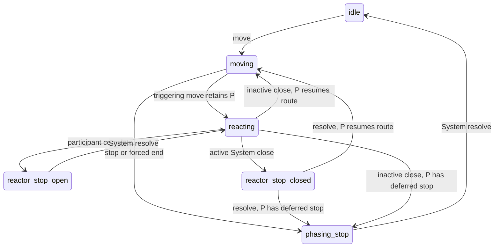

# Breakdown adjudication v1 specification

**Status:** BRK-TASK-001 contract freeze complete, 2026-09-05. Task 002 dormant Rules implemented, verification passed and independent review Ready. Task 003 dormant campaign contracts and certified Truck fixture implemented. Task 004 shared move accounting/replay and Task 005 stop/check authority implemented; Tasks 006–007 pending.
**Authority:** Owner accepted BRK-DEC-004–007 and scope after design review 3; DEC-001–003 already accepted.
**Rules:** `cna-1979.1`. **Predecessor:** ZOR-007 at `0512ec2`; exact source baseline `a047547`.

This specification and its [wire contract](breakdown-wire-contract-v1.md) govern the next dormant
implementation. [Design/task plan](../design/breakdown-adjudication-v1.md) assigns implementation
order; [source/decision packet](../research/breakdown-adjudication-spike.md) retains primary evidence
and alternatives. The [migration inventory](breakdown-fixture-migration.v1.json) is normative coverage
accounting. Current runtime identities and behavior remain unchanged until Task 006 activation.

## Objective and bounded success

A certified synthetic campaign can move an unladen Truck convoy, accrue exact Breakdown Points
(BP), stop, resolve a deterministic check, retain broken equipment at its stop location, and move
survivors again. Accepted actions replay byte-for-byte with exact RNG cursors. Reaction interruptions
retain all routes and resolve reactor stops before resumption. First-side Movement then completes
through Breakdown Determination to the existing unsupported Combat checkpoint. No Combat or later
Operation Stage becomes executable.

Core owns every calculation, state transition and rejection. Content owns immutable certification
inputs. Observation/Actions expose only approved capabilities. Runner consumes those capabilities
and verifies trusted artifacts. No protobuf, host, inference service or remote I/O changes are needed.
Use existing typed records, strict canonical codecs, exact amounts and pure event factories; keep
historical contracts intact. Loss calculation takes a collection of check inputs, even though public
admission currently bounds eligible cohorts; do not embed a single-slot assumption in reusable rules.

## Requirements

### BRK-REQ-001 — Source, outcomes and arithmetic

Source lock is Land 21.24–35 and Common Charts 21.38 as retained in the research packet. Preserve all
36 sequential coordinates across nine columns, including the non-rolling 0–3 column. First die is
tens, second units; values such as 17, 20 or 67 reject. Printed labels map exactly to fractions:
`0=0/1`, `10=1/10`, `25=1/4`, `33=1/3`, `50=1/2`, `75=3/4`. Loss is ceiling of working points times
fraction, except a one-working-point admitted check unit loses zero for label 10. The count basis is
working points immediately before this check, not initial capacity or working-plus-broken points.
Use checked integer/rational arithmetic; overflow rejects atomically. No floating point or decimal
approximation. Preserve source label separately from fraction and accepted ruling identity.

### BRK-REQ-002 — Public capability certification

Profile ID: `sandtable.capability.breakdown-truck-battalion.v1`. It is mandatory public Content 6,
Setup 6 and Observation 7 metadata, and part of their hashes. A valid declaration is necessary but
insufficient: Core independently certifies the complete selected root before exposing a campaign.

The initial grammar is deliberately conservative:

- Synthetic setup and scenario only; every placed element independently represented exactly once.
  No attachments, represented multi-element formations or mutable binding operations.
- At most one vehicle cohort per side across the entire selected campaign. Every cohort has existing
  Truck vehicle/profile IDs, belongs to a standalone `TruckConvoy` classification, has positive
  initial integer point count and no combat components. Its immutable content count is conservation
  basis. No other element has a vehicle cohort. Cohort IDs are unique campaign-wide.
- All Trucks are unladen by the profile's semantics. The closed content/command grammar has no cargo,
  passenger, load/unload, split, merge, creation, replacement or capacity-transfer state or operation.
  A caller-supplied assertion of emptiness cannot override incompatible content/classification.
- Admitted combat and headquarters elements are non-cohort battalions using existing battalion
  organization and supported nonmotorized movement facts. Every formation is a root battalion with
  exactly one independent child; no regimental shell, parent chain or unknown organization is admitted.
  A Truck also has its own root formation and uses the existing battalion movement-accounting size;
  this is synthetic convoy accounting, not a combat classification or combat strength.
- For every representation, represented formation and same-side co-located combat group, count
  distinct combat/headquarters leaves exactly once. Their summed existing stacking value must be
  at most one. Trucks and broken lots contribute no **combat** strength; ordinary Truck movement
  still uses its admitted movement-accounting stacking value. Reject unknown size/component facts.
  Current headquarters trigger and ineligibility semantics remain unchanged.
- Validate all static elements/formations in the admitted pack, and dynamic selected-world invariants
  at creation and after each transition. A move creating an own combat stack above the bound has no
  legal candidate. All inputs to that restriction are the moving owner's own facts. No action may
  change formation structure, cohort identity, combat classification, initial point count or profile.

This proves the larger-than-battalion 21.41 origin-placement predicate uniformly false, including
represented aggregates, throughout admitted history. It does **not** prove capture impossible:
21.52 can apply to a single battalion. Capture, towing, repair and all general placement remain
explicitly absent. Do not publish detailed hidden certification failures to players.

Current ZOC requires combat stacking greater than one. Positive ZOC consequently has no initial
public successor under this profile. Retain existing rule definitions, historical evidence and direct
authority tests; defer public positive-ZOC fixtures until broader placement support. Negative ZOC
and adjacency-triggered Reaction remain supported. Admission must never relax size bounds solely to
make a previous fixture pass.

### BRK-REQ-003 — Playable Truck movement and BP accounting

The successor ordinary-move path admits combat/headquarters elements under existing rules **and**
certified standalone Truck convoys. Trucks use the existing motorized mobility/CPA, terrain, route,
directional hexside, weather and ordinary stacking cost path; surviving working points do not change
CPA or CP per step. Working count zero removes every Truck move candidate and direct submissions
reject. No passenger capacity or motorized-infantry downgrade is inferred from a loss. Trucks have
no Reserve designation/release, Reaction episode, ZOC source or combat action in this profile.

Preserve ZOR-REQ-004: only a phasing **combat-element** move can trigger Reaction. A Truck move does
not open a window merely because enemies are adjacent. It still obeys existing enemy-occupied and
ZOC entry/exit movement restrictions where tested through broader dormant authority; public profile
has no positive ZOC. Adjacency to a noncombat Truck does not create a combat mover's window.

For each cohort-bearing accepted ordinary or dormant Reaction step, derive exact BP from the same
admitted movement edge and weather authority used by CP. Terrain base is transformed by the selected
route operation, with Rainstorm Road→Track transformation applied first, then the sum of all directional hexside
additions. Use the already normalized Breakdown tables. Preserve original and effective route IDs,
input sources, before/delta/after totals and Sandstorm attribution. Sandstorm adds the entire step's
BP delta to its subtotal; other weather adds zero. Non-cohort moves carry an empty accounting array.
Do not derive BP from CP or alter CP while integrating BP. Move/query/stop recording consumes no RNG.

Stage cumulative BP, Sandstorm subtotal and checked-band memory survive every stop and both sides'
Movement/Reaction. This delivery contains no later-stage reset. All updates are atomic with location,
CP, cohesion, movement-ended status and Reaction trigger/opportunities.

### BRK-REQ-004 — Route and stop lifecycle

Only one phasing element has an open route at a time. Its first accepted step freezes origin and
route identity; subsequent steps preserve origin. Another phasing mover cannot start until the
current route has a recorded and resolved stop. Stopping does not replenish CP or erase stage BP.
After resolution, surviving elements may start another route unless Movement-ended restrictions
apply; that route receives a new origin and identity.

`stop-element-movement` records a deliberate phasing stop. A phasing step that sets existing Movement-ended
status or exhausts the mover's admitted CP allowance records a forced stop in the same move event.
Do not infer a forced stop merely from an empty geometry-dependent move list. A stuck route always
retains explicit stop membership. A forced stop cannot be submitted twice. Reaction participant
completion records its moved route's stop, resolves that opportunity and clears its active slot.
The next participant waits for System resolution. Completion is legal after at least one accepted
step, even when no further move is legal. A Reaction step exhausting CP retains its active route and
opportunity until explicit participant completion or active System closure records the reactor stop;
it does not record a forced stop in the move event. Reaction steps never open nested Reaction windows.

Movement completion requires no Reaction window, open route or pending stop. This is the concrete
implementation of draining all stops **before** the segment advances; segment completion does not
invent an implicit stop batch. A campaign with no moves can complete directly. At Breakdown
Determination exactly one System completion advances to Combat with no BP reset, loss or RNG draw.

### BRK-REQ-005 — Finite continuation and interruption precedence

The following closed authority states are exhaustive. `P` is a phasing continuation of exactly two
forms: `resume-route(route)` or `resolve-stop(stop)`. It cannot contain another continuation. `W`
is the single existing frozen Reaction window. A reactor route/stop is distinct from P's route/stop.

| State | Required payload / window | Authority action and successor |
| --- | --- | --- |
| `idle` | No route/stop; W absent | Normal move → `moving`, `phasing-stop` or `reacting`; Movement complete → Breakdown checkpoint |
| `moving` | Phasing route; W absent | Same-element move keeps route or creates forced stop/window; explicit stop → `phasing-stop` |
| `reacting` | P, nullable reactor route; W present | First/reacting step → same state with active reactor route; participant complete → `reactor-stop-open`; between-episode close → P's `moving` or `phasing-stop`; active System close → `reactor-stop-closed` |
| `reactor-stop-open` | P, reactor stop; W present, active slot null | Resolve stop → `reacting` with no reactor route; even if all opportunities resolved, explicit window close follows |
| `reactor-stop-closed` | P, reactor stop; W absent | Resolve stop → P's `moving` or `phasing-stop` |
| `phasing-stop` | Phasing stop; W absent | Resolve stop → `idle` at exact suspended Movement position |

A triggering move sets P to `resolve-stop` if it forced a stop, otherwise `resume-route`. Its newly
opened W executes before a deferred phasing stop. Timeout/unavailable closure with an active route
records the reactor stop and closes W atomically, preserving P; decline/no-eligible/between-episode
closure has no fictional reactor stop. Player decline remains unavailable during an active episode;
System close remains available under its existing explicit fallback contract. No close is executable
while a recorded reactor stop is pending. No timer/inference runs inside an authority turn.

The table also covers a first step that immediately triggers/forces a stop, and forced subsequent
steps. The diagram abbreviates those equivalent entry edges. Snapshot validation rejects every
unlisted payload/window mixture. First-side stage-1 sequence position is retained exactly. Pending
stop position has System authority regardless of which side's element moved. No recursive stack or
arbitrary queue is serialized.

### BRK-REQ-006 — Check transaction, eligibility and RNG

Each pending stop has exactly one state-scoped System `resolve-breakdown-stop` action. Resolve all
moved cohorts in ordinal `(vehicleTypeId, profileId, cohortId)` order in one event; public profile
admits zero or one, but serialization/calculation remain collections. No hidden per-group action
count. Cohort membership is frozen by the route's first move and invariant until resolution.

No-roll reason precedence is: `no-working-points`, `raw-bp-not-above-three`, `below-check-surface`,
`band-not-higher`; otherwise `rolled`. Compute raw band from ceiling(total BP), index 0 for 0–3
through 8 for 71+. Add Truck BAR/profile shift plus applicable weather shift. Sandstorm shift applies
iff attributed subtotal is at least half total; Rainstorm has neutral shift after route transformation.
Index below 1 means null; clamp above 8 to 8. Eligibility uses exact raw BP >3 independently of that
shift and requires index strictly greater than retained highest checked index. No-roll retains memory
and RNG. An eligible zero-loss roll advances highest checked index and consumes actual dice draws.
The cap forbids repeated checks within 71+ merely for further BP accumulation.

Use existing authoritative `SandtableRandom.RollD6` twice in sequence for each eligible check; retain
actual cursors before/after including rejected bytes. Replay regenerates every face from prior stream,
then every outcome, count and lot. Caller-supplied faces are evidence to compare, never inputs to trust.
Batch RNG, checked memory, working/broken counts and lots commit together. An invalid component emits
no event and changes no state, World or RNG. The zero-cohort/no-roll path still emits one resolution
and follows the same continuation. No runtime hidden-dependent unsupported result is permitted.

### BRK-REQ-007 — Persistent equipment and conservation

For each positive loss create one immutable lot at the stop destination. Identity binds campaign,
ruleset, stop and check identity, owner, cohort/type, count and location. A zero loss creates no lot.
Per cohort, `workingPointCount + sum(lot.pointCount) = immutable initialPointCount`, and existing
`brokenPointCount = sum(lot.pointCount)`. Lots retain owner and location forever in this profile.
Survivor movement changes only the working element's location. Lots have no representation, stacking,
ZOC, action or combat component. Zero-working elements retain their existing identity for history
and conservation; no capacity or replacement action appears.

### BRK-REQ-008 — Disclosure and action membership

Observation 7 uses the wire contract's closed additions. Public profile ID reveals restrictions,
never hidden certification details. During normal phasing Movement, own route handle, own working/BP
facts and own broken lots may be exposed. During Reaction, preserve Observation 6's suppression of
reactor raw own rows and stable bindings. During pending System stop, both sides see a generic
`breakdown-waiting` state; retain only already approved phasing-own facts, and give neither player
stop IDs, loss groups, dice, raw reactor ledgers or authoritative continuation payloads.

Projected decision history 2 carries the same declassified state. Scope hidden-state permutation
equalities to worlds with identical **approved** audience facts; changing an observer's intentionally
published own ledger is not a secrecy equivalence. Compare full player transcript and progress for
hidden identities, eligibility, BP, locations and blockers within the certified domain. Out-of-profile
larger worlds are creation negatives, not alternate valid histories. Public Reaction losses are
zero-roll/non-cohort lifecycle evidence; motorized positive loss remains dormant only.

Legal-action envelope remains contract 2, policy becomes `sandtable.legal-actions.v3`; candidate,
submission and acceptance envelope versions remain 1 because their fields do not change. Closed kind
membership adds stop, resolve and Breakdown completion. Exact current candidate/action ID, audience,
position, state version and rules hash must match. System capabilities are never offered to players.
No submitted cohort selector, dice, chosen loss, lot location or continuation is authoritative.

### BRK-REQ-009 — Strict identity, replay and rejection

[Wire contract](breakdown-wire-contract-v1.md) pins predecessor codecs and every successor delta,
including unchanged identities. Generate new hashes from canonical bytes in dependency order; do not
invent expected hashes during this documentation freeze. Successors stay dormant through Task 005.
Task 006 switches public creation, snapshot/checkpoint restore, observations, queries, submission,
event readback/replay and Runner admission together. Current entry points then reject all legacy-only
and mixed roots; explicitly historical readers retain historical semantics. No CP-based BP backfill.

Creation returns existing result shape with `UnsupportedCapabilityProfile` (public label
`unsupported-capability-profile`) for profile admission failure; detailed trusted diagnostics use `BRK-CERT-001`–`006` below. No campaign is returned.
Stale/malformed/forged actions retain existing submission failure envelope/category conventions,
without new hidden-specific text. Internal invalid authority raises `invalid-breakdown-authority`
before acceptance; it must never be mapped to successful zero loss or player-specific capability
absence. Trusted readers additionally reject duplicate/unknown fields, noncanonical rationals,
invalid flow mixtures, wrong hashes and any semantically forged evidence despite rehashing.

| Diagnostic | Trusted condition |
| --- | --- |
| `BRK-CERT-001` | Missing/unknown profile, nonsynthetic root or mixed contract identities |
| `BRK-CERT-002` | Multiple/unsupported cohorts, wrong Truck classification or incompatible load/capacity grammar |
| `BRK-CERT-003` | Unsupported organization, formation/representation binding or oversized combat aggregate |
| `BRK-CERT-004` | Missing/unsupported movement, weather, component or source facts |
| `BRK-CERT-005` | Point/lot conservation, origin or stage-ledger violation |
| `BRK-CERT-006` | Impossible route, stop, Reaction, position or continuation combination |

The supported rollback is reverting activation as a complete version set, with newer artifacts
explicitly rejected by older current readers. No second current legacy engine or downgrade mode.

### BRK-REQ-010 — Coverage migration and delivery gates

All existing fixture bytes remain unchanged in Task 001. At activation they are identified as
historical. New fixture IDs/hashes must be built with certified Content 6, never a mechanical version
replacement. The migration inventory enumerates all fourteen checked scenario files and all fifteen
Reaction children. Every successor entry is an obligation on Tasks 003/006/007, not a passing result.

Preserve organization's supported no-obligation path, Reserve policies, CP/cost evidence and Reaction
ordering/secrecy with independent non-cohort battalion equivalents. Put reactors in separate hexes
and reject destinations that combine own combat strength above one. Negative ZOC due low defense
or HQ can be checked directly, but no public successor isolates those predicates from the profile's
size failure; label public evidence accordingly. Positive/local/remote ZOC, motorized-infantry losses,
grouping, transport, general placement/capture/repair and stage reset remain deferred public authority.
Dormant pure-calculator and finite-continuation model vectors may test broader accounting/stop
inputs; they are not valid public campaign histories and cannot bypass root/snapshot certification.

New mandatory public fixtures cover positive ordinary Truck loss, zero-loss eligible roll, no-roll,
repeated higher-band stop, moved survivors with stationary lots, zero-working movement rejection,
Reaction completion and active System close before phasing resumption. Positive-cohort Reaction and
positive-ZOC forced-end vectors are direct dormant authority evidence only. A last-CP combat trigger
can exercise deferred phasing stop ordering publicly without positive ZOC. Scripts choose public
candidates only and retain explicit stop/resolution counters to bound steps.

## Traceability and validation

The inherited twelve acceptance IDs are frozen here. [Task 002 evidence](../research/breakdown-outcome-rules.md)
records passing Rules-level portions; [Task 003 evidence](../research/breakdown-campaign-contracts.md)
records contract-level portions of AC-006/007/008/011. [Task 004 evidence](../research/breakdown-move-accounting.md)
records BP accounting, move replay and route/forced-stop portions of AC-002/006/007/008/011.
Complete campaign/Runner acceptance remains pending.

| Acceptance ID | Governing requirements / decisions | Implementing tasks | Required executable evidence |
| --- | --- | --- | --- |
| BRK-AC-001 | REQ-001 / DEC-001,004 | 002 | All 324 cells; illegal coordinates, duplicate/gap rejection; accepted fraction identity |
| BRK-AC-002 | REQ-003 / DEC-003 | 004 | Terrain/route/hexside, Rainstorm and Sandstorm threshold; ordinary/Reaction BP equality; CP unchanged |
| BRK-AC-003 | REQ-006 / DEC-001,003 | 002,005 | Exact >3 threshold, null/unchanged/capped band, zero working and reason precedence |
| BRK-AC-004 | REQ-001,006 / DEC-004 | 002,005 | Upward rounding, one-point 10%, exact one-third; zero-loss roll advances memory |
| BRK-AC-005 | REQ-006,009 / DEC-001 | 005 | Same-seed replay, rejected-byte cursor, atomic batch rejection with no emitted event |
| BRK-AC-006 | REQ-004,005 / DEC-005 | 003,005 | Every finite transition, first/last step, final-CP Reaction retains active route until completion or System closure, active fallback, deferred phasing stop, no duplicate costs/draws |
| BRK-AC-007 | REQ-003,007 / DEC-006,007 | 003,005 | Conservation, stationary lots after survivor movement, zero-working action exclusion |
| BRK-AC-008 | REQ-002,009 / DEC-006,007 | 003,006 | All six certification diagnostic classes; every transition preserves public invariant |
| BRK-AC-009 | REQ-008 / DEC-005,006,007 | 006 | Full audience transcript/progress equivalence, strict disclosure manifest and boundary gate |
| BRK-AC-010 | REQ-009 / DEC-001,004,005 | 004,005,007 | Rehashed BP/face/cursor/label/fraction/lot/band/continuation mutations rejected on replay and Runner readback |
| BRK-AC-011 | REQ-009,010 / DEC-006,007 | 003,006,007 | All-legacy/all-successor and each identity mixture across every public current boundary |
| BRK-AC-012 | REQ-004,010 / DEC-005,006,007 | 007 | Complete migration obligations, exact public Truck path to Combat, two clean runs, full gate; later stages remain closed |

Task 001 validation: research numeric checker, migration coverage/hash/link audit, canonical baseline
references and `git diff --check`. These check specification consistency, not production correctness.
Implementation validation: focused deterministic .NET tests and strict codec negatives per task;
Task 006 mandatory user-space boundary gate; Task 007 `just check` and two clean Runner runs with
matching artifacts. Exact .NET solution command is `dotnet test --solution Sandtable.slnx --no-build`.
No remote services or timing-sensitive assertions are required.

Independent research/design reviews 1–3 apply to their recorded historical targets; they do not claim
to review these new freeze bytes. That delivery's three-instance budget remains exhausted. Subsequent
production review belongs to its concrete implementation scope and cannot be used to rerun this
research decision loop. Task 005 is complete; next is **BRK-TASK-006: coherent public activation and privacy**.
[Stop/check evidence](../research/breakdown-stop-adjudication.md) records dormant authority and replay verification.
